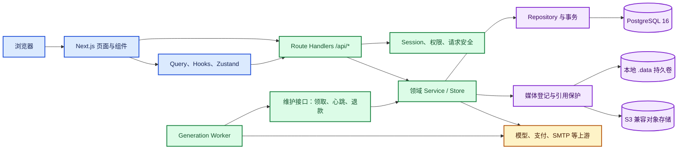
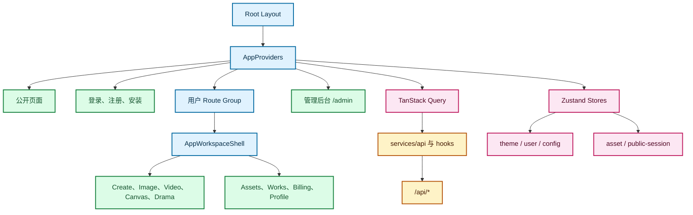
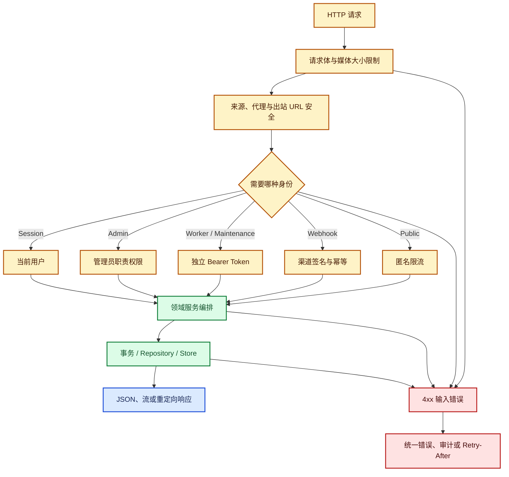
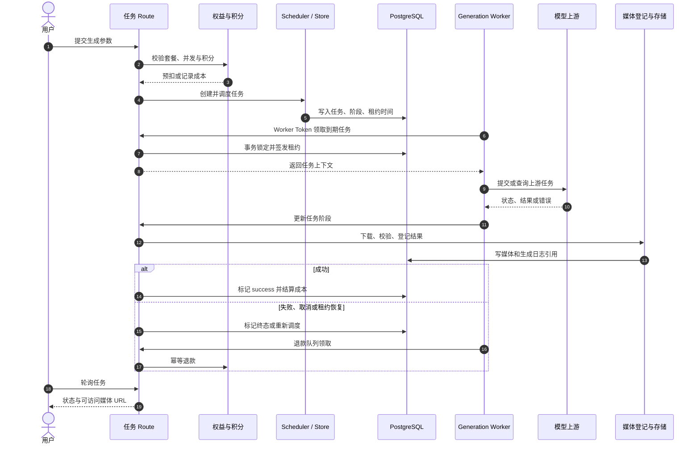
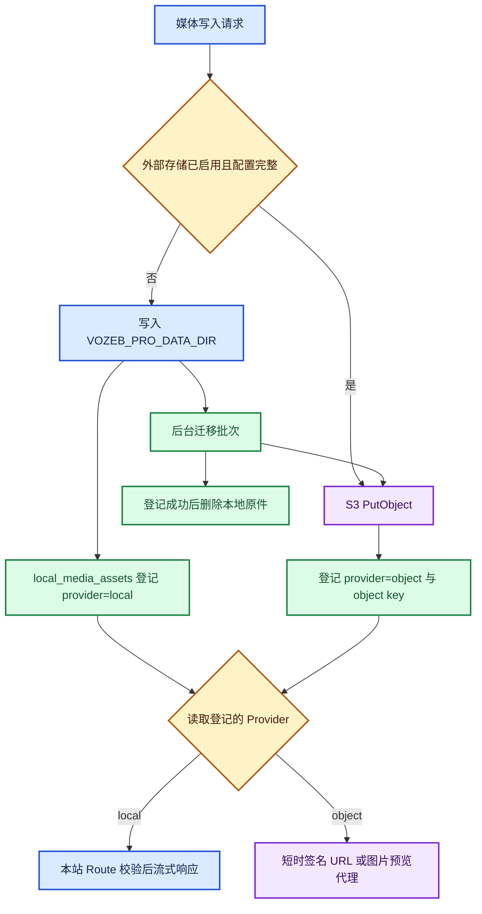
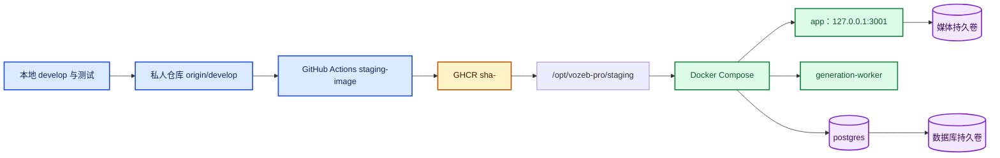

# VOZEB PRO 开发地图

> 基线：2026-09-08，`develop` 分支。当前源码包含 52 个 `page.tsx` 页面入口、343 个 API Route 文件和 117 张 PostgreSQL 表。接口逐项说明见 [VOZEB-PRO 接口索引](VOZEB-PRO-接口索引.md)，发布操作见 [VOZEB-PRO 更新与部署流程](VOZEB-PRO-更新部署流程.md)。

## 如何使用这份地图

1. 先从“业务域导航”找到要改的功能，再沿“页面 -> Route Handler -> Service/Store -> Repository/外部服务”向下追踪。
2. 改接口前先到接口索引确认权限与数据边界，不要根据 URL 名称推测权限。
3. 涉及生成任务时，同时检查 Web 请求、`generation_tasks` 状态机、Worker 和退款路径。
4. 涉及媒体时，同时检查媒体登记记录与实际文件；数据库备份不等于媒体备份。
5. 提交前按“修改风险与测试范围”选择最小测试集，再按更新流程发布。

## 文档同步门禁

- 每次拉取整合完成后、每次推送前，从仓库根目录运行 `pwsh -NoProfile -File .\过程文件\更新开发地图.ps1`，再运行 `pwsh -NoProfile -File .\过程文件\验证开发文档.ps1`。
- 验证会核对 Route、页面、PostgreSQL 表数量、接口 Handler 链接、重复路径和 UTF-8 乱码；失败时不得推送。
- 接口、页面、Service、Repository、Schema、Worker 或部署拓扑变化时，相关说明必须与代码放在同一个提交中；没有相关结构变化时不为了制造噪声修改文档。

## 技术栈与运行单元

| 层次 | 当前实现 | 开发定位 |
| --- | --- | --- |
| Web 框架 | Next.js 16 App Router、React 19、TypeScript 5 | 页面和本站 API 都在 `web/src/app` |
| UI | Ant Design 6、Tailwind CSS 4、Lucide、Motion | 全局 Provider 在 [app-providers.tsx](web/src/components/layout/app-providers.tsx) |
| 客户端数据 | TanStack Query、Zustand、`web/src/services/api` | 服务端状态用 Query，本地编辑态和偏好用 Store |
| 服务端业务 | Next.js Route Handlers + `web/src/lib/server` | 业务逻辑不应堆在页面或 Route 文件里 |
| 认证授权 | HttpOnly Session Cookie、角色和细粒度管理员权限 | 入口是 [session.ts](web/src/lib/auth/session.ts) 和 [admin-permissions.ts](web/src/lib/admin-permissions.ts) |
| 数据库 | PostgreSQL 16；保留 `file` Provider 兼容分支 | 默认是 PostgreSQL，连接与初始化在 [postgres.ts](web/src/lib/server/database/postgres.ts) |
| 后台任务 | 独立 Node.js Generation Worker | [generation-worker.mjs](web/scripts/generation-worker.mjs) 只用 Worker Token 调内部维护接口 |
| 媒体 | 本地 `.data` 持久卷或 S3 兼容对象存储 | COS、OSS、MinIO 通过 AWS S3 SDK 的兼容 Endpoint 接入 |
| 镜像 | Node.js 22 多阶段 Dockerfile、Next standalone | 同一镜像运行 `app` 和 `generation-worker` |
| 测试 | Vitest、Playwright、TypeScript、ESLint | 脚本定义在 [package.json](web/package.json) |

运行时有三个核心单元：`app`、`generation-worker`、`postgres`。浏览器只访问 `app`；Worker 不直连浏览器，也不加载完整 `.env`。它通过内部 HTTP 领取任务、发心跳并触发退款队列。

## 目录职责

| 路径 | 职责 | 修改提示 |
| --- | --- | --- |
| [web/src/app](web/src/app) | 页面、布局、Route Handlers | 页面按 `(user)`、`admin`、公开页分组；`api` 是服务端入口 |
| [web/src/components](web/src/components) | 可复用 UI、后台工作区、业务组件 | 跨页面复用放这里，页面专属组件可贴近页面 |
| [web/src/hooks](web/src/hooks) | 客户端查询与交互 Hook | 避免直接在多个组件重复请求逻辑 |
| [web/src/services/api](web/src/services/api) | 浏览器端 API Client | 统一请求、错误转换和数据类型 |
| [web/src/stores](web/src/stores) | Zustand 客户端状态 | 不用于替代服务端持久化 |
| [web/src/lib/auth](web/src/lib/auth) | 会话、用户、权益、设置与兼容数据层 | 用户身份和积分改动需重点审计并发与事务 |
| [web/src/lib/server](web/src/lib/server) | Agent、生成、媒体、计费、支付、存储等服务端逻辑 | 新业务优先落到领域 Service/Store |
| [web/src/lib/server/database](web/src/lib/server/database) | 表结构、迁移、Repository、映射 | SQL 必须参数化；跨表写入优先事务 |
| [web/scripts](web/scripts) | Worker、构建、备份恢复、管理员维护脚本 | 生产镜像只复制明确列出的运行脚本 |
| [web/public](web/public) | 静态公开资源 | 用户媒体不放这里 |
| [docs/content/docs](docs/content/docs) | 上游产品和部署文档 | 本地图补充二次开发导航，不替代产品文档 |
| [Dockerfile](Dockerfile) | 构建 standalone 生产镜像 | 构建阶段执行 typecheck 和 build |
| [docker-compose.local.yml](docker-compose.local.yml) | 本地 app、Worker、PostgreSQL | 本地镜像为 `vozeb-pro:local`，端口映射为 `3000:3000` |
| [docker-compose.yml](docker-compose.yml) | 生产容器拓扑 | 默认只绑定 `127.0.0.1:3000`，应由反向代理提供 HTTPS |

## 系统总架构

边界规则：Route Handler 负责 HTTP 解析、权限、限流和响应；Service 负责业务编排；Repository/Store 负责持久化。直接从组件访问数据库或把上游密钥返回客户端都会破坏现有边界。

## 前端页面与状态

页面共 51 个入口，主要分为：

| 页面组 | 入口示例 | 外壳/状态 | 说明 |
| --- | --- | --- | --- |
| 公开页 | `/`、`/gallery`、`/share/[slug]`、`/u/[username]` | 根布局、公开 Session Store | 可匿名浏览，部分互动动作仍要求登录 |
| 认证与安装 | `/login`、`/register`、`/forgot-password`、`/install` | 独立页面 | 安装令牌仅用于首次初始化 |
| 用户工作区 | `/create`、`/image`、`/video`、`/canvas`、`/drama` | [app-workspace-shell.tsx](web/src/components/layout/app-workspace-shell.tsx) | `(user)` 路由组负责登录态和工作台布局 |
| 资产与账户 | `/assets`、`/my-prompts`、`/works`、`/billing`、`/profile` | Query + 用户 Store | 服务端数据以 API 为事实来源 |
| 管理后台 | `/admin`、`/admin/billing`、`/admin/generation-operations` | 管理后台 Section | 页面可见性和 API 权限都要检查，不能只隐藏菜单 |

主要 Store：`use-user-store` 保存当前用户投影，`use-config-store` 保存生成配置，`use-asset-store` 管理客户端资产状态，`use-theme-store` 管理主题，`use-public-session-store` 支撑匿名浏览会话。新增服务端事实数据时优先使用 Query，不要复制一份长期缓存到 Zustand。

## API 分层与权限

299 个 Route 文件分布在 41 个一级域。数量最多的是 `admin` 91、`school` 22、`public` 16、`drama-lab` 41、`teaching` 15、`auth` 13、`drama` 12、`billing` 11。完整列表见 [接口索引](VOZEB-PRO-接口索引.md)。

权限分类不是目录规则，而是实现规则：

| 标记 | 实现证据 |
| --- | --- |
| 公开 | 操作前不要求 Session/Token；仍可能有来源校验、限流或输入限制 |
| 用户 | `getCurrentUser()` 后拒绝匿名用户，或调用的 Service 执行同等校验 |
| 管理员 | `hasAdminPermission(user, permission)` 等角色/职责权限校验 |
| Worker | `isAuthorizedWorkerRequest()` 或 Worker 上下文签名 |
| 维护 | `isAuthorizedMaintenanceRequest()`；与 Worker Token 相互独立 |
| Webhook | 渠道或支付回调签名/密钥校验及幂等记录 |
| 混合 | 同一文件的不同方法或分支采用不同身份边界 |

管理员权限定义在 [admin-permissions.ts](web/src/lib/admin-permissions.ts)，常见职责包括用户、内容、财务、商业、生成和上游管理。添加后台 API 时，必须同时配置后端权限检查、前端入口可见性和审计记录。

## 生成任务时序

图像、视频、音频、文本和 Agent 任务共用 `generation_tasks` 调度骨架，各类型仍有自己的配置、运行时、结果持久化和退款模块。

关键文件：调度和租约在 [generation-task-scheduler.ts](web/src/lib/server/generation-task-scheduler.ts)，统一存储在 [generation-task-store.ts](web/src/lib/server/generation-task-store.ts)，恢复逻辑在 [generation-task-recovery-service.ts](web/src/lib/server/generation-task-recovery-service.ts)，Worker 在 [generation-worker.mjs](web/scripts/generation-worker.mjs)。修改状态名、阶段或租约时必须同时检查四处。

## 媒体与对象存储

项目没有腾讯 COS 或阿里云 OSS 专用 SDK。它使用 `@aws-sdk/client-s3` 和可配置 Endpoint，因此可接 AWS S3、腾讯 COS 的 S3 兼容接口、阿里云 OSS 的 S3 兼容接口、MinIO 等。

后台配置字段为：启用状态、Endpoint、Region、Bucket、Prefix、Access Key、Secret Key、Path-style。设置保存在 `object_storage_settings`，Access Key 与 Secret Key 通过 `VOZEB_PRO_ENCRYPTION_KEY` 加密；前端只收到“是否已配置”，不会收到明文。

写入入口见 [object-storage-service.ts](web/src/lib/server/object-storage-service.ts)，S3 Client 见 [object-storage-client.ts](web/src/lib/server/object-storage-client.ts)，加密配置见 [object-storage-config.ts](web/src/lib/server/object-storage-config.ts)，本地和对象媒体统一登记见 [local-media-registry.ts](web/src/lib/server/local-media-registry.ts)。开启外部存储只影响新媒体；历史媒体仍按登记的 Provider 读取，迁移必须通过后台批次执行。

## 数据层边界

`VOZEB_PRO_DATABASE_PROVIDER` 为 `file` 时走兼容文件存储，否则默认为 PostgreSQL。Docker 环境固定使用 PostgreSQL。二次开发应把 PostgreSQL 当主路径，同时保持现有 Provider 分支不被无意破坏。

59 张表按职责大致分组：

| 数据域 | 代表表 | 主要入口 |
| --- | --- | --- |
| 账号与安全 | `users`、`sessions`、`email_codes`、`rate_limits`、`audit_logs` | `web/src/lib/auth`、用户 Repository |
| 权益与积分 | `entitlement_plans`、`user_plan_assignments`、`point_records`、`quota_usage` | Auth Store、Points Wallet Service |
| 生成 | `generation_tasks`、`generation_logs`、`generation_log_assets`、`generation_webhook_events`、`generation_worker_heartbeats` | Generation Store、Scheduler；RunningHub workflow context 和 `admin-workflow-test` origin 复用同一任务骨架 |
| 创作 | `creative_*`、`canvas_projects`、`drama_projects`、`drama_project_versions`、`library_assets` | 对应领域 Service/Store |
| 商业化 | `billing_*`、`payment_*`、`coupon_*`、`promotion_*`、`cdk_*` | Billing/Coupon/Promotion Service |
| 社区作品 | `published_works`、`published_work_*`、`user_follows`、`user_blocks`、`user_notifications` | Work Publication/Governance/Community Service |
| 媒体与配置 | `local_media_assets`、`object_storage_settings`、`app_settings`、`system_model_channels` | Media Registry、Object Storage Repository、Settings Store；RunningHub 工作流版本保存在渠道 `advancedConfig.workflowConfigs`，练习绑定保存在 `app_settings.practice_workflow_models` |

Schema 初始化在 [schema.ts](web/src/lib/server/database/schema.ts)、[schema-commercial-features.ts](web/src/lib/server/database/schema-commercial-features.ts) 和 [schema-triggers.ts](web/src/lib/server/database/schema-triggers.ts)。不要只加 TypeScript 类型而不更新 Schema，也不要把破坏性 SQL 塞进普通请求路径。

## 业务域导航

| 业务域 | 页面/组件 | API 前缀 | 主要服务 | 数据或外部边界 | 最小验证 |
| --- | --- | --- | --- | --- | --- |
| 安装与健康 | `/install` | `/api/install`、`/api/health` | `install-status`、数据库初始化 | PostgreSQL、安装令牌 | 安装状态、live/ready |
| 认证与账户 | 登录、注册、Profile | `/api/auth` | `lib/auth`、Profile/Deletion Service | 用户、Session、SMTP | 注册登录、Cookie、并发修改 |
| 创建工作台 | `/create` | `/api/create`、`/api/agent` | Agent Executor、Creative Runtime、`agent-planner-media.ts`（授权媒体读取及多模态输入） | 生成任务、模型上游 | Agent run、事件流、重试；`agent-run-recheck.ts` 仅恢复原子任务，未知提交不重新生成 |
| 图像/视频/音频/文本 | `/image`、`/video` | `/*-tasks`、`/video-generation-tasks` | 各类型 config/runtime/store/refund | 积分、Worker、模型、媒体 | 创建、轮询、取消、退款 |
| Canvas | `/canvas` | `/api/canvas` | Canvas Project Service/Store | `canvas_projects` | 普通画布 CRUD、所有权、短剧专属画布隔离 |
| 短剧 | `/drama`、`/drama-lab`、`/drama-canvas/[id]` | `/api/drama`、`/api/drama-lab` | Drama Project、Episode Canvas、Analysis、Render、Jianying | `drama_projects`、按集隔离的 `canvas_projects`、FFmpeg、生成任务 | 分析、版本、一集一画布、剧集切换、渲染、导出 |
| 素材与媒体 | `/assets` | `/api/library-assets`、`/api/reference-assets`、`/api/media-*` | Library/Reference/Media Service | 本地卷、对象存储 | 上传、读取、删除引用保护 |
| 提示词 | `/prompts`、`/my-prompts` | `/api/prompts`、`/api/my-prompts` | Auth Store/Prompt 数据 | PostgreSQL | 公开筛选、用户 CRUD |
| 作品与社区 | `/works`、`/gallery`、分享页 | `/api/works`、`/api/public`、`/api/community` | Publication/Governance/Community | 作品版本、互动、媒体授权 | 发布、审核、互动、匿名读取 |
| 计费与增长 | `/billing` | `/api/billing`、`/api/cdk`、`/api/referrals` | Billing/Coupon/Promotion/Referral | 支付上游、积分事务 | 下单、回调、退款、幂等 |
| 管理后台 | `/admin`（上游配置 / RunningHub 工作流） | `/api/admin`、`/api/admin/runninghub/workflows` | RunningHub Workflow Service/Test Service、各管理 Service | 渠道配置、generation_tasks、审计日志、RunningHub | 版本启停、业务 code 绑定、独立测试 origin、敏感字段脱敏 |
| 后台维护 | 无用户页面 | `/api/maintenance` | Recovery、Refund、Lifecycle | Worker/维护 Token | 未授权拒绝、领取幂等、心跳 |
| 上游代理 | 创作页面间接使用 | `/api/ai/system`、`/api/generation-webhooks` | Channel Router、Proxy Policy | 模型渠道、Webhook | SSRF、凭据隔离、签名 |

### 短剧实验室 Phase 3 边界

Phase 3 的四条主线均位于 `drama-lab` 领域，不改变普通 Canvas 或平台账户体系：

| 主线 | Route | Service | 事实源/边界 |
| --- | --- | --- | --- |
| 一键全流程 | `/api/drama-lab/projects/[id]/workflow`、`workflow/export/*` | `drama-lab-workflow-task-service`、`drama-lab-workflow-review-service` | 父/子任务复用 `generation_tasks(task_type=render)`；Worker、取消、恢复、审核和导出均按项目成员授权 |
| 团队协作与审批 | `/api/drama-lab/projects/[id]/collaboration/*`、`/api/drama-lab/invites/*` | `drama-lab-collaboration-service` | 六张 `drama_lab_*` 协作/审批表；邀请 token 只存哈希，成员/管理员关系决定项目访问和阶段门禁 |
| Canvas 显式回写 | `/api/drama-lab/canvas-projects/[id]/writeback` | `drama-lab-canvas-writeback-service` | Canvas 是 staging；仅显式目标写回短剧项目，并校验 handoff、节点绑定、媒体所有权和乐观版本 |
| 完整项目归档 | `/api/drama-lab/projects/[id]/export`、`/api/drama-lab/projects/import` | `drama-lab-project-archive` | 项目 JSON + ZIP 媒体；导入重映射业务 ID、清除旧任务引用，失败回滚并清理已写媒体 |

详细实现和人工验收项见 [短剧实验室 Phase 3 交付报告](docs/superpowers/reports/2026-09-02-drama-lab-phase-3.md)。

## 常见二次开发落点

| 目标 | 必改位置 | 同步检查 |
| --- | --- | --- |
| 新增普通页面 | `web/src/app/<route>/page.tsx`，复用 `components` | 元数据、导航、登录边界、移动端 |
| 新增用户 API | `web/src/app/api/<domain>/route.ts` + `lib/server/<domain>-service.ts` | `getCurrentUser`、所有权、限流、Client 类型、测试 |
| 新增管理员 API 和权限 | Route + [admin-permissions.ts](web/src/lib/admin-permissions.ts) + 后台菜单/组件 | `hasAdminPermission`、审计日志、不能只靠前端隐藏 |
| 新增模型渠道 | 管理后台 Channel 配置、协议定义、Logical Model Router、Provider Runtime | API Key 加密、能力约束、健康检查、代理安全 |
| 新增生成任务类型 | `*-task-config/runtime/store/refund` + 通用 Scheduler/Store + Worker 执行分支 | 状态机、租约、并发、积分、取消、恢复、媒体持久化 |
| 新增 PostgreSQL Repository 操作 | `database/*-repository.ts` + Schema/Mapper | 参数化 SQL、事务、迁移、file Provider 兼容 |
| 接入 COS/OSS/MinIO | 后台“外部存储”填 S3 Endpoint、Region、Bucket、密钥 | CORS/Endpoint、Path-style、连接测试、读写与迁移；通常无需改代码 |
| 修改套餐、积分或支付逻辑 | Auth 权益、Points Wallet、Billing/Payment Service | 金额精度、幂等、事务、退款、Webhook、审计 |
| 修改 Worker 调度和恢复 | Scheduler、Store、Recovery Service、Worker 脚本、维护 Route | 租约竞争、重试退避、心跳、重复执行、退款 |
| 新增远程环境变量 | `.env.example`、读取代码、Compose 传递、部署文档 | 默认值、是否需要 app/worker、密钥日志、重建或仅重启 |

## 修改风险与测试范围

| 风险级别 | 典型修改 | 最低测试 |
| --- | --- | --- |
| 低 | 文案、无逻辑样式、独立文档 | 目标页面检查、`git diff --check` |
| 中 | 页面交互、单域 API、普通 Repository 查询 | 相关 Vitest、`pnpm typecheck`、接口正反例 |
| 高 | 认证、管理员权限、积分、支付、生成状态机、媒体删除、Schema | 相关单测和集成测试、全量 `pnpm test`、typecheck、Docker build、关键人工流程 |
| 生产关键 | Compose、密钥、数据库迁移、对象存储切换、恢复流程 | 备份、`docker compose config --quiet`、隔离环境恢复演练、健康检查、回滚验证 |

共同检查项：

- API 是否在认证前读取或改变了敏感数据。
- 动态 ID 是否验证所有权或管理员职责权限。
- 外部 URL 是否经过安全出站校验，避免 SSRF。
- 积分、订单、Webhook 和退款是否具备事务与幂等性。
- 媒体删除是否先检查引用，迁移是否先登记成功再删本地文件。
- Worker 重试是否可能重复扣费、重复提交或覆盖成功结果。
- PostgreSQL 和 `file` Provider 的行为差异是否有意且有测试。

## 相关文档

- [VOZEB-PRO 接口索引](VOZEB-PRO-接口索引.md)：当前源码 Route 文件逐项权限、服务和边界。
- [VOZEB-PRO 更新与部署流程](VOZEB-PRO-更新部署流程.md)：本地验证、develop 推送、测试镜像、远程 Compose 更新与健康检查。
- [README](README.md)：产品能力、安装方式和上游项目说明。
- [项目结构与流程](docs/content/docs/overview/project-structure.mdx)：上游维护的结构说明。
- [配置说明](docs/content/docs/overview/configuration.mdx)：环境变量和后台配置。
- [Docker 部署](docs/content/docs/overview/docker.mdx)：官方 Compose 部署说明。

### 无限练习工作台（2026-09-08）

- `web/src/app/(user)/practice/components/practice-module-workbench.tsx`：六模块共用桌面输入/结果双栏，窄屏上下排列，使用平台主题。
- `practice-character-panel.tsx`：主形象/多视图按选中模型和 workflowCode 独立选择参数及默认尺寸，不合并两条 Schema。
- `practice-media-input.tsx`、`practice-prompt-editor.tsx`：复用真实素材上传与后台默认文本模型提示词优化；优化结果可编辑，不自动提交生成。
- `/api/practice/modules`：workflowOptions 携带对应工作流的公开 inputSchema；角色模型选项携带自身工作流列表；自动内部模型展示渠道与能力名称，不冒充某一工作流。

### 无限练习查询与历史恢复（2026-09-08）

- 图片 `image-task-custom.ts`、视频 `video-task-runtime.ts`、音频 `audio-task-runtime.ts` 的 RunningHub 官方查询复用 `queryRunningHubTask`，POST body 传 taskId，系统代理注入渠道 apiKey；继续原站内代理鉴权，不重新创建任务。
- `practice-module-workbench.tsx` 分离目录/历史读取与选中任务查询；按稳定 sessionId 恢复结果，URL切换不卸载输入表单，历史支持加载更多。
- 视频输入增加已完成配音选择及去配音入口；配音使用六维情绪滑杆，主文本对应首行的参考音色与情绪一起提交。
