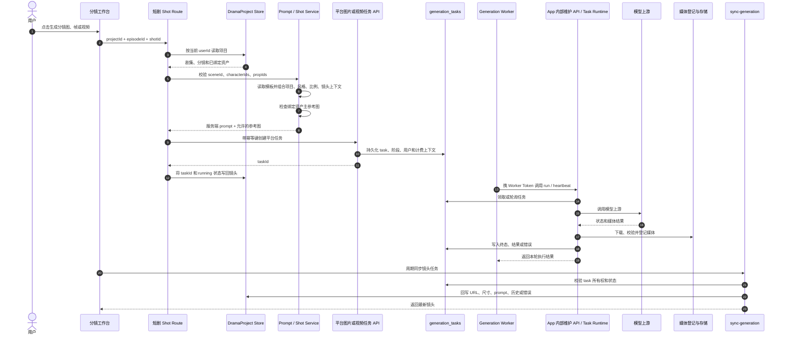

# VOZEB PRO 与短剧实验室融合架构现状

> 日期：2026-09-01
> 核对基线：`823b4ae` 及当前工作区源码
> 范围：VOZEB PRO 总体运行架构、短剧实验室接入边界、LocalMiniDrama 业务迁移现状
> 判定原则：只把已经接入真实 API、服务、持久化或任务状态机的能力计为实现；页面、按钮、Schema 或 `setTimeout` 演示不算业务完成。

## 1. 结论

短剧实验室**不是简单嵌入**，也不是 iframe、外链或另一套 LocalMiniDrama 服务挂在 VOZEB PRO 菜单里。它已经是 VOZEB PRO 模块化单体中的一个原生业务域：

- 页面运行在同一个 Next.js App Router 用户工作区；
- 使用同一套 Session、用户所有权和管理员权限；
- 项目主数据写入 VOZEB PRO 的 `drama_projects`，版本写入 `drama_project_versions`；
- 文本模型通过平台逻辑模型路由、系统 AI 计费和生成日志调用；
- 图片、视频通过平台 `generation_tasks`、Generation Worker、退款和媒体链路执行；
- 一集绑定一个独立的 `canvas_projects`，并使用短剧专属 Canvas 运行时；
- 媒体继续受平台素材登记、引用保护和用户删除流程约束。

但它也**没有完成 LocalMiniDrama 全部业务闭环**。当前准确状态是：

| 层面 | 当前定性 | 含义 |
| --- | --- | --- |
| 产品入口与技术栈 | 原生融合 | 是 VOZEB PRO 内部页面和 API，不是外挂应用 |
| 身份、数据、模型、计费、媒体等平台基础设施 | 大部分融合 | 主要运行链路已经复用平台能力 |
| 短剧领域编排 | 部分完成 | 基础剧本、资产、分镜和媒体生成可运行，但高级恢复和多集流程不完整 |
| LocalMiniDrama 行为等价 | 未完成 | 多集、续写恢复、音频、跨镜连续性、完整导入导出等仍有差距 |

一句话定性：

> 当前是“VOZEB PRO 内部原生实现的短剧垂直业务域”，不是简单嵌入；平台层已经融合，LocalMiniDrama 的完整生产工作流仍在迁移。

## 2. 什么才叫“融合”

从第一性原理看，是否融合不能由页面长得像不像判断，而要检查六个运行边界：

1. **身份边界**：是否使用 VOZEB PRO Session、权限和用户所有权。
2. **数据边界**：是否进入平台主数据库，并有明确唯一事实源。
3. **模型边界**：是否通过平台模型路由，密钥是否仍留在服务端。
4. **成本边界**：是否进入平台计费、幂等、日志和退款。
5. **任务边界**：长任务是否可持久化、轮询、恢复、取消和去重。
6. **媒体边界**：结果是否登记、可追踪、受引用保护并能安全删除。

短剧实验室已经满足前四项和大部分媒体边界；任务边界只在图片、视频上较完整，故事生成、资产提取和分镜提取仍是同步请求。这就是“架构已融合，但业务闭环未全部融合”的原因。

## 3. VOZEB PRO 总体架构图

VOZEB PRO 当前是以 Next.js 为 Web/BFF、PostgreSQL 为主数据源、独立 Generation Worker 驱动长任务的模块化单体。Worker 只携专用 Token 调用 App 内部维护接口，不直接连接数据库，也不持有模型渠道配置。

```mermaid
flowchart TB
    subgraph Client[客户端]
        Public[公开站点与作品页]
        Workspace[用户创作工作区]
        Admin[管理后台]
    end

    subgraph Web[Next.js 16 应用]
        Pages[App Router 页面与 React 组件]
        Routes[Route Handlers /api/*]
        Guard[请求安全与限流]
    end

    subgraph Domains[业务域]
        Account[统一账号与登录]
        School[学校、教学、商单与制作组]
        Create[Create / Agent 创作]
        MediaGen[图像、视频、音频、文本生成]
        Canvas[普通 Canvas]
        Drama[短剧与短剧实验室]
        Assets[素材与媒体]
        Works[作品、社区与发布]
        Billing[计费、积分与增长]
        Ops[管理与运营]
    end

    subgraph Platform[平台核心能力]
        Auth[Session、平台管理员权限]
        SchoolAccess[学校成员守卫与租户隔离]
        SchoolCompute[学校算力与个人积分结算]
        ModelRouter[逻辑模型路由与系统 AI 代理]
        TaskSystem[generation_tasks、调度与恢复]
        Worker[Generation Worker]
        Maintenance[内部维护 API：run、heartbeat、refund]
        TaskRuntime[图片、视频、音频、文本任务 Runtime]
        Charge[积分、幂等、结算与退款]
        Logs[generation_logs 与审计]
        Registry[媒体登记与引用保护]
        Config[系统渠道、模型与应用配置]
    end

    subgraph Data[数据与文件]
        PG[(PostgreSQL 16：用户、项目、学校、任务)]
        Local[(本地持久卷 .data)]
        Object[(S3 兼容对象存储)]
    end

    subgraph External[外部服务]
        AI[文本、图片、视频、音频上游]
        Pay[支付渠道]
        Mail[SMTP]
    end

    Public --> Pages
    Workspace --> Pages
    Admin --> Pages
    Pages --> Routes
    Routes --> Guard
    Routes --> Auth
    Auth --> Guard
    Guard --> Account
    Guard --> School
    Guard --> Create
    Guard --> MediaGen
    Guard --> Canvas
    Guard --> Drama
    Guard --> Assets
    Guard --> Works
    Guard --> Billing
    Guard --> Ops

    Account --> Auth
    School --> SchoolAccess
    School --> SchoolCompute
    Create --> ModelRouter
    MediaGen --> TaskSystem
    Canvas --> TaskSystem
    Canvas --> SchoolCompute
    Drama --> ModelRouter
    Drama --> TaskSystem
    Drama --> Registry
    Drama --> SchoolCompute
    Assets --> Registry
    Billing --> Charge
    Ops --> Config

    ModelRouter --> Charge
    ModelRouter --> Logs
    ModelRouter --> AI
    Auth --> PG
    SchoolAccess --> PG
    SchoolCompute --> PG
    TaskSystem --> PG
    Worker --> Maintenance
    Maintenance --> TaskSystem
    Maintenance --> TaskRuntime
    TaskRuntime --> AI
    TaskRuntime --> Registry
    TaskRuntime --> Charge
    TaskRuntime --> Logs

    Create --> PG
    Canvas --> PG
    Drama --> PG
    Works --> PG
    Billing --> PG
    Config --> PG
    Registry --> PG
    Registry --> Local
    Registry --> Object
    Billing --> Pay
    Guard --> Mail
```



### 3.1 关键分层

| 层 | 职责 | 主要位置 |
| --- | --- | --- |
| 页面层 | 展示、交互和短期编辑状态 | `web/src/app`、`web/src/components` |
| API/BFF 层 | HTTP 解析、认证、限流和响应 | `web/src/app/api` |
| 领域服务层 | 业务规则与跨服务编排 | `web/src/lib/server` |
| Store/Repository 层 | 数据持久化、事务和并发控制 | `web/src/lib/server/database` 及各领域 Store |
| 任务执行层 | Worker 触发内部维护 API；App 内任务 Runtime 完成领取、上游调用、轮询、恢复和退款 | `generation_tasks`、维护 Route、`generation-worker.mjs` |
| 外部适配层 | 模型渠道、对象存储、支付和邮件 | 系统 AI 代理及对应服务端适配器 |

### 3.2 账号、学校与创作资产边界

这部分决定短剧实验室是否真正进入 VOZEB PRO 主架构，而不只是复刻一个页面：

| 边界 | 当前实现 | 真实含义 |
| --- | --- | --- |
| 统一身份 | `users` + `vozeb_pro_session` Cookie + 数据库 Session | 教师、学生、普通用户和平台管理员都从同一登录入口进入；教师/学生不是另一套账号系统 |
| 平台授权 | `users.role = admin \| user`，再叠加 `users.manage`、`education.manage` 等细粒度权限 | 平台管理员权限与学校成员权限是两条正交授权链，不能互相替代 |
| 学校身份 | `school_memberships.role = teacher \| student`，`school.manage` 只授予学校管理能力 | 学校管理员本质是“教师 + `school.manage`”，不是新的平台角色 |
| 学校租户 | 业务表携带 `school_id`，服务端从 Session 推导学校并显式过滤；复合外键约束同校关系 | 已有真实学校隔离，但当前没有 PostgreSQL RLS，隔离依赖服务层和 SQL 条件 |
| 学校数量 | `school_memberships.user_id` 唯一 | 当前模型是一账号最多加入一所学校，不是任意多学校切换 |
| 创作资产归属 | `drama_projects`、`canvas_projects`、`library_assets`、`generation_tasks` 按 `user_id`/`owner_user_id` 归属 | 学校不直接拥有成员的全部创作资产；学校作业、商单和制作组只保存经过校验的个人成果引用 |
| 学校算力 | 学校池 → 制作组额度 → 商单项目 → 生成任务；不足时使用组内个人垫付 | 短剧和 Canvas 只有在有效学校商单/制作组关联下使用学校算力，否则走个人积分 |

短剧实验室因此复用的是同一条平台底座：登录和 Session、用户所有权、学校上下文、模型路由、生成任务、计费/退款、日志和媒体登记。学校作业或商单引用短剧项目时，服务端会再次校验项目确实属于当前用户和当前学校，不能只相信前端传入的 `schoolId` 或 `billingContext`。

这也给出“融合程度”的准确判断：

1. **平台架构层：已融合。** 短剧已经进入 VOZEB PRO 的统一身份、主数据库、任务、模型、计费、日志、媒体和学校算力边界。
2. **短剧基础生产层：已形成真实链路。** 剧本、资产、分镜、帧、分镜图、单镜视频和一集一个 Canvas 均有服务端实现。
3. **L/LocalMiniDrama 行为等价层：仍在迁移。** 多集故事任务、小说导入、分镜断点恢复、跨镜首尾帧连续性、音频/TTS、完整导入导出等不应因为平台层已融合就标记为完成。

## 4. 短剧实验室如何接入 VOZEB PRO

```mermaid
flowchart LR
    User[用户] --> LabUI[/drama-lab 工作台]
    LabUI --> LabAPI[/api/drama-lab/*]

    subgraph DramaDomain[短剧领域]
        ProjectService[Drama Project Service / Store]
        ScriptService[剧本生成服务]
        AssetService[角色、场景、道具提取服务]
        StoryboardService[分镜提取与真实资产 ID 校验]
        FrameService[首帧、关键帧、尾帧提示词规划]
        ShotService[分镜图与视频任务编排]
        SyncService[任务结果同步与镜头回写]
        PromptService[九套短剧系统模板]
        EpisodeCanvas[一集一个 Canvas 投影服务]
        Jianying[当前集剪映草稿导出]
    end

    LabAPI --> ProjectService
    LabAPI --> ScriptService
    LabAPI --> AssetService
    LabAPI --> StoryboardService
    LabAPI --> FrameService
    LabAPI --> ShotService
    LabAPI --> SyncService
    LabAPI --> EpisodeCanvas
    LabAPI --> Jianying

    PromptService --> ScriptService
    PromptService --> AssetService
    PromptService --> StoryboardService
    PromptService --> FrameService
    PromptService --> ShotService

    ProjectService --> DramaDB[(drama_projects)]
    ProjectService --> Versions[(drama_project_versions)]
    ScriptService --> TextPlatform[平台文本模型路由、计费与日志]
    AssetService --> TextPlatform
    StoryboardService --> TextPlatform
    FrameService --> TextPlatform

    ShotService --> ImageTasks[/api/image-tasks]
    ShotService --> VideoTasks[/api/video-generation-tasks]
    ImageTasks --> Tasks[(generation_tasks)]
    VideoTasks --> Tasks
    Worker[Generation Worker] --> Maintenance[App 内部维护 API]
    Maintenance --> Tasks
    Maintenance --> TaskRuntime[App 内任务 Runtime]
    TaskRuntime --> Providers[模型上游]
    TaskRuntime --> Media[媒体登记与存储]
    Tasks --> SyncService
    SyncService --> DramaDB

    EpisodeCanvas --> CanvasDB[(canvas_projects)]
    CanvasDB --> DramaCanvas[/drama-canvas/:canvasId]
    DramaCanvas --> IsolatedRuntime[短剧专属 Canvas 运行时副本]
    IsolatedRuntime --> ImageTasks
    IsolatedRuntime --> VideoTasks

    DramaDB -. 项目与剧集真实 ID .-> EpisodeCanvas
    DramaDB -. sceneId / characterIds / propIds .-> StoryboardService
```

### 4.1 数据事实源

短剧运行时不是把 L 的数据库原样搬进来。当前主事实源是：

| 数据 | 唯一事实源 | 说明 |
| --- | --- | --- |
| 项目、剧集、资产、分镜及结果字段 | `drama_projects.project_json` | 保存完整 `DramaProject`；API 按 `user_id` 校验所有权 |
| 项目快照 | `drama_project_versions` | 支持保存和恢复版本 |
| 图片、视频任务 | `generation_tasks` | 使用平台任务生命周期和 Worker |
| 文本、图片、视频调用记录 | `generation_logs` | 短剧文本服务和媒体任务进入平台日志 |
| 一集一个专属画布 | `canvas_projects` | `sourceHandoffId=drama-lab-canvas:<projectId>:episode:<episodeId>` |
| 资产和镜头媒体 | 平台媒体登记及本地/S3 存储 | 受用户删除和引用保护约束 |

`schema-drama-lab.ts` 中还保留了一批短剧专属兼容表。当前主运行链路没有使用其中的 `drama_lab_async_tasks`、`drama_lab_image_generations`、`drama_lab_video_generations` 等表，而是使用平台 `generation_tasks`。这说明媒体任务已经向平台架构融合，也说明旧兼容 Schema 后续需要清理或明确用途。

### 4.2 Canvas 的特殊边界

Canvas 不是直接把普通 `/canvas` 页面改造成短剧页面，也不是再写一套简化画布：

- 普通 Canvas 源码保留在 `web/src/app/(user)/canvas`；
- 短剧运行时副本位于 `web/src/features/drama-canvas-runtime`；
- `sync-manifest.json` 记录源 commit、同步文件和短剧适配补丁；
- 短剧通过专属 `/api/drama-lab/canvas-projects` 访问画布，只能读写短剧绑定的 Canvas；
- 进入时把当前集剧本、项目资产、分镜、帧和视频按真实 ID 投影成节点；
- 再次同步会更新系统投影节点，同时保留用户自由节点、自由连线和布局；
- 普通 Canvas 与短剧 Canvas 的删除、导航和所有权边界互不影响。

因此 Canvas 当前应定性为：**受控复制的 UI 运行时 + 平台共用的任务与数据基础设施 + 短剧专属适配层**。这样可以降低上游作者继续更新普通 Canvas 时的合并风险。

## 5. 一次分镜生图/生视频的真实数据流



首帧、关键帧、尾帧比普通分镜图多一步：服务端先使用对应帧模板调用文本模型生成结构化图片提示词，再清洗非本镜角色，然后把提示词和绑定资产参考图交给图片任务。视频使用当前关键帧或分镜图作为视觉输入，并把平台任务 ID 留在镜头上用于恢复和去重。

## 6. 已经做到什么

### 6.1 平台融合已经完成的部分

| 能力 | 状态 | 当前实现事实 |
| --- | --- | --- |
| 原生页面和路由 | 已完成 | `/drama-lab`、`/api/drama-lab` 与 VOZEB PRO 同应用部署 |
| Session 与用户隔离 | 已完成 | 项目、任务和画布均按当前 `userId` 校验 |
| 项目 CRUD 与并发保存 | 已完成基础链路 | Project Store 持久化并处理版本冲突；实验室创建入口仍绕过部分标准初始化 |
| 项目版本 | 已完成 | 支持保存、列出和恢复 `drama_project_versions` |
| 平台模型路由 | 已完成 | 文本使用 `logical-model-router`，图片/视频使用平台默认模型 |
| 计费、幂等和退款 | 已完成基础链路 | 文本和媒体任务携带系统 AI 计费头及请求幂等键 |
| 生成日志 | 已完成基础链路 | 文本、图片、视频进入平台 `generation_logs` |
| 图片/视频任务 | 已完成基础链路 | 创建、轮询、恢复、结果同步和历史回写均有真实 API |
| 媒体与引用保护 | 已完成基础链路 | 使用平台媒体地址、任务结果和删除清理机制 |
| 管理后台提示词 | 已完成基础链路 | 只保留九套绑定模板，可编辑、恢复默认，运行时真实读取 |
| 一集一个 Canvas | 已完成 | 项目+剧集形成稳定绑定，剧集和分镜可定位 |

### 6.2 短剧业务已经形成的真实能力

- 项目创建、编辑、删除、自动保存和版本恢复；
- 从已有剧本项目选择并导入当前剧集内容；
- 对当前一集生成剧本文本；
- 分别提取角色、场景和道具，并保存项目内真实资产；
- 为角色、场景、道具添加或生成主参考图；
- 一键提取分镜，并强制校验 `sceneId`、`characterIds`、`propIds`；
- 保存分镜与资产绑定，拒绝项目外或模型虚构的资产 ID；
- 分镜图生成前检查已绑定资产是否存在主参考图，缺失时返回明确错误；
- 首帧、关键帧、尾帧的文本规划、参考图输入和图片任务；
- 单镜分镜图、视频的真实任务创建、状态同步、结果回写和重试保护；
- 当前集剪映草稿 ZIP 导出；
- 当前集专属 Canvas、资产/剧本/分镜投影、剧集切换、分镜定位和返回上下文。

## 7. 还没有做到什么

### 7.1 部分完成

| 能力 | 已有部分 | 仍缺部分 |
| --- | --- | --- |
| 项目标准初始化 | 项目 CRUD、所有权、保存和版本已经接入 | 实验室 `POST /api/drama-lab/projects` 直接调用 Store，未复用标准创建服务中的默认首集、Creative Conversation 和 IP 引用初始化 |
| 故事生成 | 当前集真实调用文本模型并记录日志 | `episodeCount` 只作为提示上下文，不会创建多集；无异步 task、取消、恢复、去重和服务端原子保存 |
| 九套 Prompt | 九个键、后台编辑/恢复和运行时注入已接通 | 是否与 L 的成熟正文和全部语义逐项等价，尚未形成内容级验收基线 |
| 分镜提取 | 真实 AI 拆镜、基础摄影字段、资产 ID 白名单和保存已完成 | 缺少 `classic/universal`、完整段落/灯光/景深字段、增量保存、截断续写和部分结果恢复 |
| 帧连续性 | 同一镜头尾帧可读取首帧提示词和首帧图 | 缺少上一镜尾帧复用、跨镜状态合同、首尾帧上传、历史恢复和布局锁 |
| 视频生成 | 单镜真实任务、平台日志、结果回写、运行中去重和待检查恢复已完成 | 缺少音频/TTS、按音频拆镜、完整跨镜连续性和全批次终态语义 |
| 批量生成 | 可以批量发起请求 | 当前按钮不等待全部子任务进入终态，不能把“请求已提交”当成“批次已完成” |
| Canvas | 一集一画布、真实 ID 投影、自由内容保留和普通 Canvas 隔离已完成 | Canvas 生成结果默认只留在 Canvas，缺少明确“应用到短剧资产/分镜”的回写服务 |
| 导出 | 当前集剪映草稿可真实导出 | 缺少完整项目 ZIP 导入/导出及 L 的全部项目迁移信息 |

### 7.2 明确未完成或仅为演示

| 能力 | 当前事实 |
| --- | --- |
| 导入小说 | 按钮没有文件选择、章节识别、AI 改写或导入 API，是死入口 |
| 手工剧本多集解析 | 粘贴或选择剧本不会自动识别章节并创建多集 |
| 故事生成多集任务 | 没有服务端多集队列、逐集持久化、轮询、取消和断点恢复 |
| 一键全流程 | 当前核心推进由前端定时器模拟，不是真实服务端编排 |
| AI 内容审核 | 当前审核结果由前端定时器模拟，不是真实模型审核和持久化状态机 |
| 团队协作与审批 | 当前主要是前端演示状态，没有完整成员、审批任务和服务端状态机 |
| TTS、对白和旁白音频 | 没有形成短剧音频生成、绑定和按音频拆镜闭环 |
| `classic/universal` 双模式 | 未迁入运行契约与持久化 |
| 完整跨镜首尾帧衔接 | 没有自动把上一镜尾帧作为下一镜首帧基准 |
| Canvas 结果回写 | 没有明确选择目标资产/镜头/字段并做版本校验的应用动作 |

### 7.3 后台存在但未接入运行链路的配置

后台目前有 AI 配置、业务场景、生成设置、SD2 资产等专属表和 CRUD 页面，但运行服务的源码调用关系显示：

- 短剧文本实际读取平台默认文本模型和系统模型渠道；
- 短剧图片、视频实际读取平台默认图片/视频模型并进入平台任务系统；
- `drama_lab_generation_settings`、`drama_lab_business_scenarios`、`drama_lab_sd2_assets` 未被当前剧本、资产、分镜、图片或视频服务读取；
- 九套 `drama_lab_prompt_templates` 是这些专属配置中已经确认进入真实运行链路的一项。

因此这些管理 Tab 中，“可以保存配置”不等于“已经影响生成行为”。测试和交付时必须按运行调用链验收，不能只验收 CRUD 页面。

## 8. 当前最准确的成熟度判断

不建议再使用“已经迁移 70%/80%”作为验收结论。字段数量、路由数量和页面数量无法反映任务恢复、数据一致性和连续性。

建议使用以下三层验收：

1. **平台原生性：通过。** 短剧实验室已经进入 VOZEB PRO 的身份、数据、模型、计费、日志、媒体和 Canvas 边界。
2. **基础短剧生产链：基本通过。** 当前一集可以完成剧本、资产、分镜、分镜图、帧、单镜视频和剪映导出。
3. **LocalMiniDrama 完整行为等价：未通过。** 多集故事任务、小说导入、分镜恢复、跨镜连续性、音频和完整项目迁移仍是主要缺口。

## 9. 旧审查结论的修正

`docs/audits/2026-08-23-localminidrama-storyboard-migration-audit.md` 仍可作为 L/V 差异基线，但其中“可视化 Canvas 缺失”已经过时：

- `d3b09b7` 已实现一集一个隔离画布；
- `2be4f96` 加固了剧集画布所有权和生命周期；
- 当前真正缺失的是 Canvas 到短剧业务数据的明确回写，而不是 Canvas 入口或画布运行时本身。

后续更新迁移审查时，应把 Canvas 从“未实现”改为“基础投影与隔离已完成，业务回写部分完成”。

## 10. 关键源码索引

| 主题 | 源码 |
| --- | --- |
| 项目领域服务与存储 | `web/src/lib/server/drama-project-service.ts`、`drama-project-store.ts` |
| 剧本生成 | `web/src/lib/server/drama-lab-script-generation-service.ts` |
| 资产提取 | `web/src/lib/server/drama-lab-asset-extraction-service.ts` |
| 分镜提取与 ID 校验 | `web/src/lib/server/drama-lab-storyboard-extraction-service.ts` |
| 分镜图/视频上下文 | `web/src/lib/server/drama-lab-shot-generation-service.ts` |
| 首/关键/尾帧规划 | `web/src/lib/server/drama-lab-frame-generation-service.ts` |
| 任务结果回写 | `web/src/app/api/drama-lab/projects/[id]/shots/[shotId]/sync-generation/route.ts` |
| 一集一个 Canvas | `web/src/lib/server/drama-lab-episode-canvas-service.ts` |
| Canvas 绑定契约 | `web/src/lib/drama-lab-canvas-contract.ts` |
| 短剧 Canvas 运行时 | `web/src/features/drama-canvas-runtime` |
| Canvas 同步来源 | `web/src/features/drama-canvas-runtime/sync-manifest.json` |
| 九套模板及运行读取 | `web/src/lib/drama-lab-prompt-templates.ts`、`drama-lab-prompt-template-service.ts` |
| 平台任务骨架 | `web/src/lib/server/generation-task-store.ts`、`generation-task-scheduler.ts` |
| 数据库扩展 | `web/src/lib/server/database/schema-drama-lab.ts` |
