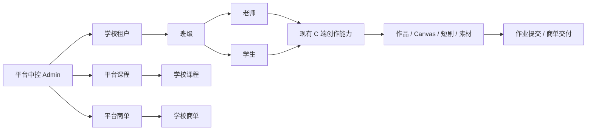

# 学校多租户、教学与商单模块设计

## 1. 背景

VOZEB PRO 当前是单平台账号体系，用户全局角色只有 `admin` 和 `user`。平台已具备登录、管理员职责权限、充值、积分、创作 Agent、Canvas、短剧、素材库、作品和媒体存储等能力。

本次改造将平台定位为产教融合培训中心：平台统一维护课程和商业订单，将其分配给不同学校；学校作为独立租户组织老师和学生开展教学、实训与商单制作。老师和学生继续作为普通 C 端用户使用现有创作与充值能力。

## 2. 目标

- 平台中控可以创建、维护和停用学校。
- 平台中控可以维护课程，并将同一课程分配给一所或多所学校。
- 平台中控可以维护商单，并将一个商单独占分配给一所学校。
- 学校管理员可以管理本校资料、老师、学生和班级。
- 学校可以把获配课程安排给班级和老师，老师可以补充资料、发布作业和批改提交。
- 学校可以组织老师和学生完成获配商单，并向平台提交最终成果。
- 作业和商单成果复用现有作品、Canvas、短剧、素材及生成结果，不复制媒体。
- 学校之间的数据严格隔离，平台管理员可按职责跨学校管理。
- 现有 C 端充值、积分、创作、社区和个人作品能力保持不变。

## 3. 非目标

首期不建设以下能力：

- 学校教学进度大屏或经营大屏。
- 学校钱包、校内积分分配或新的课程结算系统。
- 商单线上分账、学校结算或自动打款。
- 商单竞稿、跨校协作和跨校拆单。
- 院系、专业或可配置组织树。
- 课程版本系统和复杂审批流。
- 自定义校内角色与细粒度权限编辑器。
- 学校自建平台课程或正式商单。

学校收费继续使用现有商品、支付、充值和积分体系。老师和学生以普通 C 端身份自行使用现有充值体系。商单首期只管理分配、制作、提交和验收，财务在线下处理。

## 4. 总体架构

采用租户扩展层，不扩大全局账号角色：

- `admin`：平台管理员，使用现有蓝色伽马中控后台，不绑定学校。
- `user`：现有普通用户，可额外拥有一条学校成员关系。
- `teacher`、`student`：学校成员关系中的校内身份，不是全局账号角色。
- 学校管理员：`teacher` 身份加 `school.manage` 校内权限，本质上仍是老师。

一个普通账号只能属于一所学校。平台管理员不通过学校成员身份访问学校数据，而是使用现有管理员 Session 和职责权限。



## 5. 页面与导航

所有页面复用项目现有 Next.js、React、TypeScript、Ant Design、Tailwind、组件、主题和交互模式。后台管理页继续采用列表或卡片、创建按钮、Modal 或 Drawer 表单、详情页状态操作，不另建视觉体系。

### 5.1 平台中控

只新增三个业务入口：

- 学校管理：学校资料、状态和首位学校管理员。
- 课程管理：课程维护与学校分配在同一个模块内完成。
- 商单管理：商单维护、单校分配、交付审核与验收在同一个模块内完成。

不增加独立的课程分配、商单分配或学校教学进度菜单。

### 5.2 学校后台

只有 `teacher + school.manage` 可以进入，包含：

- 学校资料。
- 成员管理。
- 班级管理。
- 课程管理。
- 商单管理。

学校后台不设置教学数据大屏。一个学校可以有多个管理员，但管理员必须首先是老师。首期仅设置 `school.manage` 一个附加权限。

成员管理支持单个创建、批量导入、老师邀请码、学生邀请码、禁用和移出成员。学校管理员可以给本校老师增加或取消 `school.manage`。

### 5.3 老师 Web

在现有 C 端工作区新增“教学中心”，包含我的班级、我的课程、作业管理、商单任务、学生提交与批改。老师只能操作自己负责的班级、课程和商单。

### 5.4 学生 Web

在现有 C 端工作区新增“学习中心”，包含我的课程、课程课时、我的作业、商单实训、提交记录与老师反馈。学生只能访问自己所在班级的教学内容。

## 6. 学校与班级

学校组织结构固定为：

```text
学校
└── 班级
    ├── 老师
    └── 学生
```

- 一个账号只能属于一所学校。
- 一个学生可以加入本校一个或多个班级。
- 一个老师可以负责本校多个班级。
- 一个班级可以有多个老师和多个学生。
- 学校和成员均支持可用、禁用状态。
- 中控创建学校时同步指定首位学校管理员。
- 后续成员既可由学校管理员创建或批量导入，也可通过区分身份的学校邀请码注册。

## 7. 课程业务

### 7.1 平台侧

平台课程保存标题、封面、说明、章节、课时、正文和附件。平台管理员在课程详情或编辑流程中选择一所或多所学校完成分配。

课程使用简单状态：`draft`、`published`、`disabled`。只有已发布课程可以分配。

### 7.2 学校侧

学校不能修改平台课程，只能：

- 选择使用课程的班级。
- 指定负责老师。
- 增加本校补充资料。
- 发布普通作业或商单实训作业。
- 批改和反馈学生提交。

首期不建设课程版本系统。学校读取平台课程当前内容，本校补充资料、作业、提交和批改独立保存。课程停用后不能创建新的教学安排，已有教学记录保留为只读。

课程闭环为：

```text
平台创建并发布课程
→ 分配学校
→ 学校安排班级和老师
→ 老师补充资料并发布作业
→ 学生学习和提交
→ 老师批改
```

## 8. 商单业务

### 8.1 平台侧

平台商单保存标题、需求、参考资料、截止时间、验收标准、内部金额和唯一承接学校。商单金额仅平台中控可见。

一个商单只能分配给一所学校，不支持竞稿、跨校协作或拆单。学校开始制作后不能直接更换承接学校；平台需要先取消当前商单，再重新建立分配。

### 8.2 学校侧

- 学校管理员指定负责老师和可选参与班级。
- 负责老师安排参与学生。
- 学生使用现有创作工具制作并提交成果。
- 负责老师筛选、整理并提交学校最终成果。
- 学校管理员可以查看和处理本校全部商单。
- 平台只验收学校正式提交的最终成果，不逐个验收学生作品。

商单状态为：

```text
draft
→ assigned
→ in_progress
→ submitted
→ revision_required
→ submitted
→ accepted
```

另保留 `cancelled` 终态。验收完成后不能继续修改交付内容。平台要求修改时必须附带原因，学校在原商单内继续修改和再次提交。

## 9. 成果复用

作业和商单交付仅保存现有业务记录的稳定引用，不保存第二份媒体。允许引用：

- 公开或私有作品。
- Canvas 项目。
- 短剧项目。
- 素材库资产。
- 图片、视频等生成结果。

引用使用经过服务端校验的结构：

```ts
type SchoolContentReference = {
    type: "work" | "canvas" | "drama" | "asset" | "generation";
    id: string;
};
```

提交时必须验证记录存在、提交人拥有该记录、提交人属于当前学校。资源已删除或无权访问时禁止提交并返回中文错误。媒体访问继续使用现有归属、签名 URL 和引用保护机制。

## 10. 数据与服务边界

首期使用以下业务实体，对应表由现有 PostgreSQL Schema、repository 和文件 Provider 共同实现：

```text
schools
school_memberships
school_classes
school_class_members
platform_courses
school_course_assignments
school_course_offerings
teaching_assignments
teaching_submissions
commercial_orders
commercial_order_participants
commercial_order_deliveries
```

关键约束：

- `school_memberships.user_id` 唯一。
- 同一课程对同一学校只能存在一条有效分配。
- 一个商单只有一个 `assigned_school_id`。
- 班级成员、负责老师和学生必须属于相同学校。
- 所有学校在线查询必须带 `school_id`、实体、状态和分页等定向条件。
- 现有 C 端业务表不增加 `school_id`，保持个人数据语义。

API 按业务入口分区：

```text
/api/admin/schools
/api/admin/courses
/api/admin/commercial-orders
/api/school/*
/api/teaching/*
```

Route Handler 只解析请求、鉴权、调用服务并映射 `{ code, data, msg }` 响应。学校、课程、教学和商单规则放在 `web/src/lib/server/`，数据库访问放在现有 repository 层，并保持 PostgreSQL 与项目既有文件 Provider 的相同业务接口。前端请求继续放在 `web/src/services/api/`。

## 11. 权限与数据隔离

- 学校接口先校验当前 Session，再解析唯一学校成员关系。
- 学校管理员接口要求 `school.manage`。
- 老师业务校验负责班级、课程或商单关系。
- 学生业务校验所在班级、任务和本人提交。
- 访问其他学校的数据按不存在处理，避免泄露实体存在性。
- 平台管理员跨学校访问必须使用现有管理员职责权限，不复用学校成员权限。
- 商单金额只通过平台管理员接口返回，学校和师生响应不包含该字段。

## 12. 异常处理

- 已属于学校的账号不能加入其他学校。
- 重复课程分配返回原有效记录，不产生重复数据。
- 课程停用后禁止新建教学安排，历史记录只读。
- 商单开始制作后禁止直接换校。
- 商单状态转换由服务端控制，非法状态转换返回明确中文错误。
- 已验收商单禁止修改或再次提交。
- 失效、越权或跨校成果引用禁止提交。
- 成员、班级、课程安排、作业与提交的关联修改使用事务或文件 Provider 的既有串行写入语义。

## 13. 测试与验收

测试必须覆盖：

- 平台管理员、学校管理员、老师和学生四类权限矩阵。
- 两所学校之间的读取、修改和引用隔离。
- 单个创建、批量导入和邀请码注册。
- 课程发布、分配、班级安排、作业发布、提交和批改。
- 商单单校分配、制作、提交、退回修改、再次提交和验收。
- Canvas、短剧、作品、素材和生成结果引用。
- PostgreSQL repository、文件 Provider、Route Handler、service、类型检查和全量测试。
- 平台中控、学校后台、老师 Web 和学生 Web 的桌面、390px、430px 浏览器回归。
- 现有登录、充值、积分、创作、社区和个人作品流程无回归。

最终验收结果：平台可以创建学校并下发课程和商单；学校可以管理班级与成员、开展教学并完成商单；老师和学生继续正常使用现有全部 C 端能力；不同学校无法访问彼此数据。

## 14. 实施顺序

1. 学校租户、成员、班级和校内权限。
2. 平台课程、学校分配、教学安排、作业和批改。
3. 平台商单、单校分配、制作、提交和验收。
4. 跨租户安全、全量回归、浏览器验收和数据库文档更新。
