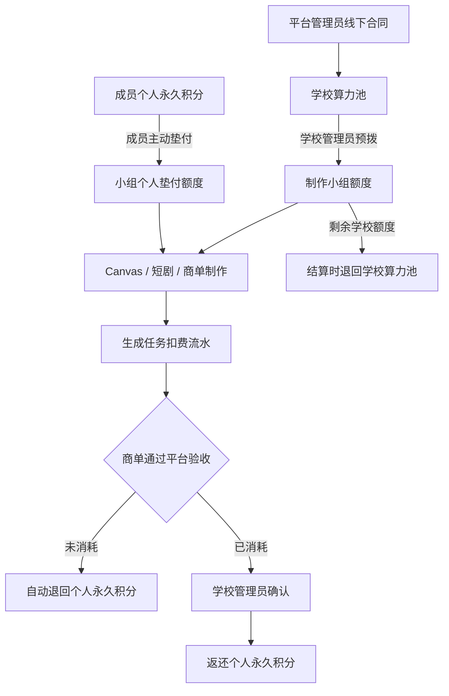

# 学校算力池与制作小组设计计划

## 1. 背景

平台已经支持学校租户、班级、老师、学生、商单、Canvas、短剧和个人积分。学校与平台线下签订业务合同后，平台需要给学校配置一笔可用于正式制作的算力额度。商单制作的实际成本由学校承担，但一个制作小组的额度可能不足，成员可以先使用个人永久积分临时垫付，商单结算后由学校确认并返还对应算力点。

当前项目和短剧按单个用户归属，系统没有通用的多人共享项目、项目成员 ACL 或实时协同编辑能力。因此第一期建设轻量“制作小组”，复用现有学校成员、商单参与人、作品提交和生成任务，不把 Canvas/短剧改造成多人共同编辑工作区。

## 2. 目标

- 平台管理员可以为学校建立和维护学校算力池。
- 学校算力池只允许本学校成员的正式制作使用，学校之间严格隔离。
- 学校管理员可以创建独立于班级的制作小组，设置组长和成员。
- 制作小组可以关联一个或多个商单，并登记成员使用的 Canvas、短剧或作品引用。
- 学校管理员可以从学校算力池向制作小组预拨额度。
- 组长可以向学校申请追加小组额度。
- 小组额度不足时，老师或学生可以主动使用个人永久积分临时垫付。
- 每次生成都能追溯到学校额度、小组额度或个人垫付中的实际扣费来源。
- 商单通过平台验收后，自动退回个人垫付的未消耗部分；已消耗部分由学校管理员统一确认返还。
- 返还只操作个人平台永久积分，不涉及平台现金退款。
- 无限练习继续使用 `open-source-practice` 执行策略，不扣学校算力池，也不扣个人积分。

## 3. 非目标

第一期不建设以下能力：

- 多人同时编辑同一个 Canvas 或短剧项目。
- 通用团队工作区、实时光标、在线冲突合并和项目级成员 ACL。
- 跨学校制作小组或跨学校算力转移。
- 学校线上现金结算、提现或自动打款。
- 将每日赠送积分转入制作小组。
- 让学校成员创建平台商单或自建收费商单。
- 复杂的团队绩效、计件工资或成员分账。

第一期以商单制作作为主要扣费场景。后续如果学校明确要求，学校管理员可以把同一套账本扩展到学校分配的正式项目；普通个人创作仍使用个人积分，无限练习保持免费开源模型策略。

## 4. 核心概念

### 4.1 学校算力池

学校算力池是平台按线下合同给学校配置的算力额度。它是学校级预算边界，不等同于平台 RunningHub 余额，也不等同于某个用户的个人积分。

学校算力池包含可用余额、已分配余额、已消耗余额、冻结状态和完整流水。平台管理员可以充值、调账、冻结或恢复；学校管理员只能查看本校余额和流水，并将可用额度分配给制作小组。

### 4.2 制作小组

制作小组是学校内独立于班级的生产组织。一个班级可以拆分出多个制作小组，一个制作小组也可以关联多个商单。小组拥有组长、成员、状态、小组额度和关联商单，但不改变成员原有学校身份。

制作小组对项目的关联是“业务引用”，不是项目所有权转移：成员仍然拥有自己的 Canvas/短剧项目；小组成员可以通过商单提交、成果引用和学校授权的页面查看协作信息，但第一期不开放其他成员直接编辑项目。

### 4.3 个人临时垫付

个人临时垫付是成员主动把个人永久积分转入指定制作小组，用于该小组的一份正式商单。第一期每笔垫付必须绑定具体商单，项目引用作为可选追踪信息。垫付必须由本人显式确认，不能因为小组余额不足而自动扣除个人积分。

个人临时垫付：

- 只能来源于个人永久积分。
- 不允许使用每日赠送积分。
- 必须绑定学校、小组和具体商单。
- 可按实际使用情况部分消耗。
- 未消耗部分在项目结算时自动退回。
- 已消耗部分在学校管理员确认后退回。

## 5. 总体架构



算力来源与模型渠道解耦：RunningHub 或后续本地模型只负责执行生成；算力账本决定本次生成由谁承担费用。替换模型渠道不需要改变学校、小组或个人垫付结构。

## 6. 角色与权限

### 6.1 平台管理员

- 查看所有学校的算力池汇总和流水。
- 给学校充值算力、做有原因的调账。
- 冻结或恢复学校算力池。
- 查看学校、小组、商单和个人垫付的关联记录。
- 处理异常结算，但不参与学校日常返还审批。

平台管理员继续使用管理员 Session，不通过学校成员身份访问学校数据。首期复用现有职责权限：学校和小组配置需要 `education.manage`，充值、调账和涉及积分的后台操作需要 `billing.manage`；全权限管理员自动拥有全部能力。本期不新增独立的算力权限，也不扩展自定义权限编辑器。

### 6.2 学校管理员

学校管理员仍是 `teacher + school.manage`，可以：

- 查看本校算力池。
- 创建、编辑、冻结和归档制作小组。
- 设置组长和成员。
- 从学校算力池向小组预拨或收回未使用额度。
- 审批组长的追加申请。
- 查看本校商单、生成消费和个人垫付。
- 在商单验收完成后统一确认已消耗个人垫付的返还。

### 6.3 组长

- 查看所在小组的额度、消费和成员垫付。
- 关联商单和项目引用。
- 提交追加算力申请。
- 发起商单结算准备。
- 不能直接修改学校池余额，也不能代替成员确认个人垫付。

### 6.4 普通老师和学生

- 查看自己参与的小组和可见额度摘要。
- 使用小组额度完成正式生成。
- 主动确认个人永久积分垫付。
- 查看自己的垫付、消耗和返还记录。
- 不能查看其他学校数据，不能直接调整小组额度。

## 7. 账本设计

### 7.1 三层余额

| 层级 | 所有者 | 用途 | 是否可直接消费 |
| --- | --- | --- | --- |
| 学校算力池 | 学校 | 学校预算和小组分配 | 否，先分配给小组 |
| 小组学校额度 | 制作小组 | 学校拨给小组的正式制作额度 | 是 |
| 小组个人垫付额度 | 成员个人，按笔记录 | 小组额度不足时临时补充 | 是 |

个人普通积分继续作为用户个人钱包存在，不进入小组前不参与学校账本。每日赠送积分不能转入小组。

### 7.2 流水类型

学校和小组使用追加写入的不可变流水，余额通过事务更新并保存快照。建议流水类型如下：

- `school_credit`：平台给学校充值。
- `school_adjustment`：平台有原因调账。
- `group_allocate`：学校池分配给小组。
- `group_release`：小组结算时将未使用学校额度退回学校池。
- `group_consume`：使用学校拨给小组的额度。
- `personal_advance`：成员个人永久积分转入小组。
- `personal_consume`：生成任务消耗个人垫付。
- `personal_unused_refund`：结算时自动退回未消耗个人垫付。
- `personal_consumed_refund_pending`：已消耗个人垫付等待学校确认。
- `personal_consumed_refund`：学校确认后返还个人永久积分。
- `generation_refund`：生成失败或取消时退回原扣费来源。

每笔流水必须包含稳定幂等键、金额、前后余额、创建人、学校、小组、商单、项目或生成任务引用。流水不能通过删除来修正，异常使用反向流水处理。

### 7.3 生成扣费来源

生成服务在创建任务前解析真实扣费来源，前端不能直接提交扣费金额或伪造学校、小组身份。默认扣费顺序为：

1. 小组剩余学校额度。
2. 小组成员已确认的个人垫付额度，按垫付时间先进先出。
3. 若两者合计不足，拒绝创建任务并提示小组补充额度。

一次生成允许拆成最多两条扣费记录，分别对应学校额度和个人垫付。每条记录都关联同一个生成任务，以便失败退款和商单结算准确回溯。

如果生成任务失败、取消或上游未产生可用结果，必须退回原扣费来源；不能统一退回当前操作用户，也不能把学校额度错误退成个人积分。

## 8. 业务流程

### 8.1 平台给学校充值

1. 平台管理员选择学校，填写算力点数量、合同备注和幂等业务编号。
2. 服务端锁定学校算力池并写入充值流水。
3. 充值成功后学校池可用余额增加，后台返回新的余额和流水编号。
4. 重复提交相同幂等编号只返回原结果，不重复增加余额。

充值是平台后台的业务记账，不连接在线支付，也不代表学校已经完成线上付款。

### 8.2 学校创建小组并分配额度

1. 学校管理员创建小组，设置名称、组长和初始成员。
2. 小组必须属于当前学校，组长和成员必须是 active school membership。
3. 学校管理员选择学校池可用额度，分配给小组。
4. 服务端在同一事务中减少学校池可用余额、增加小组学校额度并写入分配流水。
5. 小组可以关联商单，也可以先创建后再关联商单。

小组归档前必须结算未使用学校额度和个人垫付；存在未结算流水时只能冻结，不能物理删除。

### 8.3 组长申请追加额度

1. 组长填写申请金额、商单或项目、用途说明。
2. 申请状态为 `pending`，不自动占用学校池余额。
3. 学校管理员批准后，服务端原子执行学校池到小组的额度分配。
4. 拒绝时必须记录原因，申请保留只读记录。
5. 同一申请使用幂等键，不能重复分配。

### 8.4 成员临时垫付

1. 成员在小组详情中点击“临时补充小组算力”。
2. 页面明确显示小组、商单、垫付数量和“只使用个人永久积分”的说明。
3. 成员主动确认后，服务端锁定个人钱包和小组垫付额度，在同一事务中完成扣除、转入和流水写入。
4. 个人永久积分不足、成员已退出学校或小组被冻结时，操作失败且不产生部分扣款。
5. 垫付记录展示原始金额、已消耗、未消耗、待返还和已返还金额。

### 8.5 商单制作与扣费

商单继续沿用现有单校分配和参与人流程。学校管理员或组长将小组关联到商单后，参与成员使用自己的 Canvas/短剧和现有生成工具制作。正式生成请求带有经过服务端校验的小组和商单上下文，生成任务保存扣费来源。

小组关联不会把项目所有权改成小组，也不会向其他成员开放用户原本无权访问的项目内容。最终成果仍通过现有作品、Canvas、短剧和生成结果引用提交，由负责老师整理并提交学校正式交付。

### 8.6 商单结算与个人返还

触发条件为商单通过平台验收，之后进入算力结算状态：

1. 系统冻结该商单的新增扣费；如果小组仍关联其他未结算商单，小组学校额度继续保留给其他商单使用。
2. 按扣费流水计算学校额度和个人垫付的实际消耗。
3. 绑定该商单的个人垫付未消耗部分自动退回个人永久积分。
4. 绑定该商单的个人垫付已消耗部分生成“待学校确认返还”记录。
5. 学校管理员可以按商单批量确认，也可以逐笔处理。
6. 确认后，系统将已消耗部分返还到成员个人永久积分，并写入关联返还流水。
7. 小组学校额度只有在小组整体结算或归档时，才将未使用部分退回学校算力池；如果学校为某个商单单独预留额度，可以在该商单结算时释放对应预留部分。

返还只产生平台算力点变动，不产生现金退款。学校未确认时，已消耗部分保持待确认状态；不能因重复打开页面或重复提交而重复返还。

## 9. 状态与异常处理

### 9.1 状态

- 学校算力池：`active`、`frozen`、`closed`。
- 制作小组：`draft`、`active`、`frozen`、`settling`、`settled`、`archived`。
- 追加申请：`pending`、`approved`、`rejected`、`cancelled`。
- 个人垫付：`active`、`partially_consumed`、`pending_school_confirmation`、`returned`、`disputed`。

冻结学校池或小组后，禁止新建扣费和新增垫付，但允许查看流水、处理失败退款和完成已开始的结算。

### 9.2 关键不变量

- 学校池可用余额不能为负数。
- 小组学校额度和个人垫付额度不能为负数。
- 小组已分配额度不能超过学校池可用余额。
- 个人垫付不能超过个人永久积分余额。
- 每笔生成扣费只能引用真实存在且未结清的来源余额。
- 同一垫付记录的未消耗返还和已消耗返还不能重复执行。
- 学校、成员、小组、商单和项目引用必须属于同一学校。
- 已验收商单不能继续新增生成扣费。

### 9.3 异常处理

- 生成失败或取消：按原扣费来源自动退款。
- 学校池余额不足：拒绝分配，不产生负余额。
- 小组额度不足且没有足够个人垫付：拒绝生成，提示追加或垫付。
- 学校管理员撤回额度：只能撤回小组未使用的学校额度。
- 成员退出学校：禁止新增垫付和消费；其未结算垫付保留到结算处理。
- 商单取消：按该商单已确认的实际扣费执行结算，绑定该商单的个人垫付按来源退回；小组共享学校额度继续留在小组，单独预留额度可以释放回学校池。
- 结算冲突：使用事务锁和幂等键，重复请求只返回第一次结果。

## 10. 页面与入口

### 10.1 平台后台

在现有产教运营分区增加“学校算力池”：

- 学校算力池列表：学校、总额度、可用额度、已分配、已消耗、状态。
- 学校详情：充值、调账、冻结/恢复、流水和关联小组摘要。
- 充值/调账使用 Modal 或 Drawer，填写数量、原因和幂等业务编号。
- 只读查看小组分配、商单消费和个人垫付，不在平台后台代替学校进行日常返还确认。

财务相关操作继续遵循后台当前权限和脱敏审计要求。

### 10.2 学校后台

在学校商单管理下增加“制作小组与算力”：

- 制作小组列表和创建入口。
- 小组成员、组长、关联商单和额度摘要。
- 学校池可用额度与小组分配。
- 追加申请审批。
- 商单结算和个人垫付返还确认。
- 本校算力流水和按商单筛选。

学校后台不展示其他学校数据，也不开放平台充值入口。

### 10.3 老师和学生 Web

- 项目或商单详情显示当前小组和额度摘要。
- 成员可以查看自己的垫付入口和个人返还记录。
- 组长看到“申请追加算力”。
- 生成前显示实际扣费来源和预计消耗；学校额度不足时提示个人垫付或申请追加。
- 个人钱包中增加“制作小组垫付”记录筛选，不与普通消费流水混为一谈。

无限练习入口和页面保持原设计，继续使用学校成员权限和开源练习执行策略，不显示学校算力池扣费提示。

## 11. 数据与服务边界

建议新增以下业务实体，实施时按以下稳定名称建立 PostgreSQL 表和文件 Provider 记录：

```text
school_compute_pools
school_compute_ledger_entries
school_production_groups
school_production_group_members
school_compute_allocation_requests
school_compute_group_projects
school_compute_personal_advances
school_compute_settlements
school_compute_consumptions
```

职责边界：

- Route Handler：解析请求、Session/权限校验、调用服务和返回 `{ code, data, msg }`。
- `web/src/lib/server/`：小组、额度分配、垫付、结算、扣费来源解析和状态转换。
- `web/src/lib/server/database/`：PostgreSQL repository、事务、行锁、唯一约束和分页查询。
- 生成任务服务：接受服务端生成的 billing context，保存来源记录和原始流水 ID；不自行解释学校业务规则。
- 现有个人钱包服务：继续负责个人永久积分余额和积分流水；实现阶段需要增加与个人垫付业务记录的稳定引用，保证扣除和返还在同一事务语义内完成。
- 文件 Provider：与 PostgreSQL 保持相同的业务接口和串行写入语义。

学校在线查询必须带 `school_id`、实体关系、状态、时间窗和有界分页条件。新表和索引完成后同步更新 `docs/content/docs/backend/backend-database.mdx`。

## 12. API 草案

```text
/api/admin/schools/:schoolId/compute
/api/admin/schools/:schoolId/compute/credit
/api/admin/schools/:schoolId/compute/ledger

/api/school/production-groups
/api/school/production-groups/:groupId
/api/school/production-groups/:groupId/members
/api/school/production-groups/:groupId/allocate
/api/school/production-groups/:groupId/allocation-requests
/api/school/production-groups/:groupId/personal-advances
/api/school/production-groups/:groupId/settlement
/api/school/compute/ledger
```

生成入口不接受客户端传入的余额或扣费来源。服务端从当前 Session、学校成员关系、小组关系、商单状态和项目引用解析 billing context，并把最终扣费来源写入生成任务关联记录。

## 13. 实施分阶段

### 阶段一：账本与数据基础

- 新增学校算力池、小组、成员、流水、追加申请和结算数据结构。
- 实现 PostgreSQL repository、文件 Provider、事务锁和幂等操作。
- 扩展个人永久积分扣除/返还的业务引用，不接入每日赠送积分。
- 增加服务层不变量和权限测试。

### 阶段二：平台与学校后台

- 平台后台学校算力池列表、充值、调账、冻结和流水。
- 学校后台制作小组、成员、额度分配和追加申请审批。
- 学校算力池和小组额度的本校隔离回归。

### 阶段三：生成任务扣费接入

- 正式生成请求接入小组和商单 billing context。
- 按学校额度、个人垫付顺序解析来源，支持双来源拆分扣费。
- 生成失败、取消和上游异常按原来源退款。
- 无限练习继续绕过学校算力池和个人积分。

### 阶段四：商单结算与返还

- 平台验收完成后冻结商单算力账单。
- 自动释放学校额度和退回个人未消耗垫付。
- 学校管理员批量或逐笔确认已消耗个人垫付返还。
- 增加待确认、已确认、异常记录和审计展示。

### 阶段五：用户端接入与回归

- 商单、Canvas、短剧生成前展示额度和实际扣费来源。
- 成员垫付、组长申请、个人返还记录。
- 桌面端、390px、430px 页面回归及现有 C 端生成流程回归。

## 14. 验收标准

- 平台管理员能给指定学校充值，重复提交不会重复增加余额。
- 学校管理员能创建独立于班级的制作小组并分配学校额度。
- 小组额度不足时，组长可以申请追加，学校审批后额度原子增加。
- 成员只能主动使用个人永久积分垫付，不能使用每日赠送积分。
- 学校成员无法访问其他学校的小组、额度和流水。
- 正式生成能记录学校额度和个人垫付的真实扣费来源，失败时退回原来源。
- 小组可以关联商单和项目引用，但不会改变 Canvas/短剧的用户所有权。
- 商单通过平台验收后，绑定该商单的个人未使用垫付自动返还；小组整体结算或归档时，学校额度未使用部分返还学校池。
- 已消耗个人垫付只有学校管理员确认后才返还，重复确认不会重复加积分。
- 无限练习不扣学校算力池、不扣个人积分，并保持现有学校绑定和开源模型策略。
- 现有个人充值、普通积分消费、Canvas、短剧、商单提交和验收流程无回归。

## 15. 后续扩展

如果第一期运行稳定，再评估完整团队工作区：项目成员 ACL、共享 Canvas/短剧、共享素材权限、版本冲突处理、操作审计和多人协同编辑。该能力应作为独立项目，不与学校算力池第一期绑定交付。
