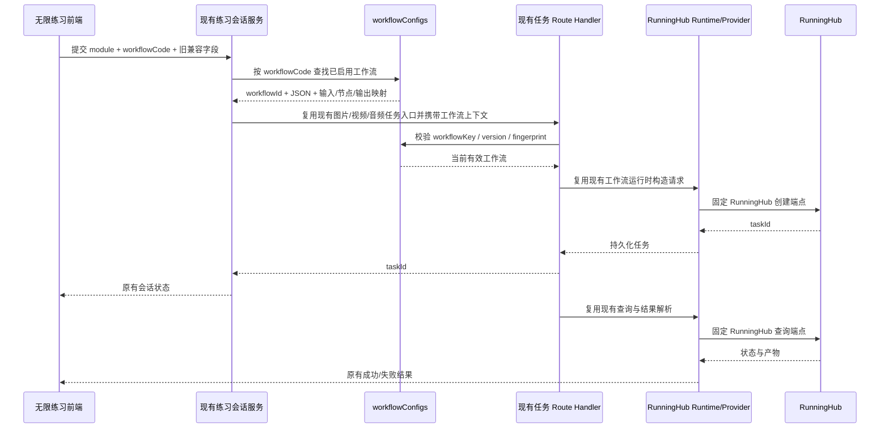

# RunningHub Demo 对齐与伪模型清理设计

## 1. 文档目的

本文固化 RunningHub 无限练习专用渠道的最终产品边界、数据清理规则、后台操作流程、后端调用链和验收标准，作为后续实施文档的唯一依据。

本文中的截图只作为当前后台状态的证据，不作为新的产品要求。`过程文件/Runninghub-demo` 是已跑通闭环的标准；当前 VOZEB PRO 必须适配 Demo，而不是让 Demo 适配当前平台的通用模型结构。

## 2. 最终结论

RunningHub 不是平台通用模型渠道，而是**无限练习专用的工作流渠道**。

最终业务链路只有：

```text
RunningHub 渠道凭据
    ↓
RunningHub 工作流
    ↓
工作流 JSON / 输入映射 / 节点映射 / 输出映射
    ↓
后台真实测试
    ↓
测试成功后启用
    ↓
无限练习按 workflowCode 调用
```

不再使用以下中间链路：

```text
工作流
    ↓
RunningHub 伪模型
    ↓
逻辑模型
    ↓
练习默认模型
    ↓
工作流
```

本次采用“在现有骨架上做减法”的方式，不新建第二套 RunningHub 路由系统、不新建任务系统、不复制 Demo 的 Java 工程结构。

## 3. 已确认的范围

### 3.1 本期必须完成

1. RunningHub 只支持“无限练习”，不支持正式生产，不支持共享。
2. 清除当前配置中的 RunningHub 伪模型、逻辑模型绑定和练习模型绑定。
3. 停止 `deriveRunningHubPracticeRouting()` 及所有“工作流自动生成伪模型”的逻辑。
4. RunningHub 工作流成为唯一人工配置对象和唯一实际调用依据。
5. 保留并复用现有工作流初始化、读取 JSON、保存、测试、启用/停用、版本和任务执行能力。
6. 让后台操作顺序与 Demo 一致：渠道凭据 → 初始化 Demo → 拉取/读取 JSON → 保存 → 测试 → 启用。
7. 测试成功且当前配置没有变化时才能启用工作流。
8. 无限练习前端页面、卡片、表单、按钮、文案和交互不改。
9. 后端兼容现有无限练习前端提交的旧字段，但旧字段不再作为 RunningHub 的业务路由依据。
10. 普通 OpenAI、Gemini 及其他非 RunningHub 渠道的模型体系不改。

### 3.2 本期明确不做

1. 不重新设计一套 RunningHub 专用 API 路由。
2. 不新增 RunningHub 专用数据库表。
3. 不新增上游模型目录。
4. 不让运维人员填写创建路径、查询路径、任务 ID 字段、结果字段、状态字段或请求模板。
5. 不让 RunningHub 进入正式生产、共享、统一 Agent、图片工作台、视频工作台、音频工作台、Canvas 正式生产或短剧正式生产。
6. 不修改 `web/src/app/(user)/practice` 下的无限练习前端页面。
7. 不复制 Demo 的原生 HTML/CSS 风格。
8. 不在本期增加批量发布、定时启用、自动故障切换或复杂节点图编辑器。

## 4. Demo 标准

标准 Demo 路径：

```text
C:\CODE\VOZEB-PRO\过程文件\Runninghub-demo\Runninghub-demo
```

Demo 已验证以下能力：

- 一个 RunningHub 地址和一个 API Key；
- 七条固定业务工作流；
- 工作流自身保存 Workflow ID、输入字段、节点映射、输出映射、运行选项、尺寸选项、超时和 API JSON 快照；
- 从 RunningHub 拉取 API 格式 JSON；
- 按工作流配置提交真实任务；
- 查询真实任务状态；
- 解析图片、视频、音频和文本产物；
- 测试任务与生产任务使用同一套 RunningHub 创建、查询和输出契约；
- 不依赖模型目录、逻辑模型或默认模型。

Demo 固定的 RunningHub 协议由 Provider 内部处理：

| 能力 | 固定端点 |
| --- | --- |
| 创建任务 | `POST /task/openapi/create` |
| 查询任务 | `POST /openapi/v2/query` |
| 拉取 API 格式 JSON | `POST /api/openapi/getJsonApiFormat` |
| 上传参考媒体 | `POST /openapi/v2/media/upload/binary` |

这些端点不是后台运营配置项。后台只保存渠道地址和密钥，服务端按 RunningHub Provider 的固定协议调用。

## 5. 七条标准工作流

七条工作流继续复用当前受控 Demo 目录：

```text
C:\CODE\VOZEB-PRO\web\src\lib\server\runninghub-demo-workflows.json
```

| workflowCode | Demo 工作流 | 能力 | 无限练习入口 |
| --- | --- | --- | --- |
| `character_main_view` | 角色主形象图 | image | 角色练习的主形象 |
| `character_multi_view` | 角色多视图 | image | 角色练习的多视图 |
| `scene_main_view` | 场景 360 度全景 | image | 场景练习 |
| `prop_main_view` | 道具主视图 | image | 道具练习 |
| `storyboard_shot` | 分镜单镜头图 | image | 分镜图片练习 |
| `storyboard_shot_video` | 分镜视频生成 | video | 分镜视频练习 |
| `storyboard_dialogue_audio` | 分镜台词音频合成 | audio | 配音练习 |

`workflowCode` 是工作流的稳定业务标识。现有 `businessCode` 仅保留为内部能力分组和既有适配器所需字段，不得再被解释为模型 ID，也不得用于生成模型绑定。

角色的两条工作流虽然可以共享图片能力分组，但实际调用必须按精确的 `workflowCode` 区分，不能用“图片模型”代替角色主形象或角色多视图。

## 6. 目标架构：复用现有链路并删除中间层

### 6.1 目标调用链



### 6.2 删除后的职责边界

| 组件 | 继续负责 | 不再负责 |
| --- | --- | --- |
| RunningHub 渠道 | 地址、API Key、启用状态、固定用途 | 上游模型目录、逻辑模型绑定 |
| `workflowConfigs` | 七条工作流及其版本、JSON、映射、测试证据、启用状态 | 生成模型别名 |
| 练习会话服务 | 按 `workflowCode` 绑定会话、版本和 fingerprint | 通过逻辑模型寻找工作流 |
| 任务 Route Handler | 复用现有图片/视频/音频任务入口，识别工作流上下文 | 把 RunningHub 工作流解析为普通模型 |
| RunningHub Runtime/Provider | 构造 Demo 形状请求、提交、查询、解析 | 从后台读取运维人员填写的通用 API 契约 |
| 普通模型路由 | 非 RunningHub 渠道的模型解析 | 处理 RunningHub 工作流 |

## 7. RunningHub 渠道后台设计

### 7.1 渠道配置

RunningHub 渠道的用途固定为：

```text
无限练习
```

后台显示为只读信息，不提供“正式生产 / 无限练习 / 共享”切换。

运营人员只填写：

- 渠道名称；
- RunningHub 地址；
- API Key；
- 渠道启用状态。

以下内容从 RunningHub 后台界面移除或隐藏：

- 上游模型列表；
- 模型目录；
- `createPath`；
- `queryPath`；
- `taskIdField`；
- `resultField`；
- `statusField`；
- `requestTemplate`；
- 通用模型能力档案；
- 正式生产和共享用途。

服务端必须强制 `protocol=runninghub` 的渠道使用 `purpose=open-source-practice`。即使客户端提交 `production` 或 `shared`，也不能保存或启用。

### 7.2 工作流管理

继续使用现有工作流后台，不新建页面、不新建接口体系。工作流列表是 RunningHub 渠道的主运营对象，展示：

- 工作流名称；
- `workflowCode`；
- 能力类型；
- Workflow ID；
- API JSON 快照状态；
- 最近测试状态；
- 版本；
- 启用状态。

工作流编辑只面向 Demo 中真实存在的工作流字段：

- 工作流显示名称；
- `workflowCode` / 业务归类；
- RunningHub Workflow ID；
- 输入字段定义；
- 节点映射；
- 输出映射；
- 运行选项；
- 生成尺寸选项；
- 超时；
- 备注；
- API JSON 快照。

创建路径、查询路径、任务 ID 字段、结果字段、状态字段和请求模板由服务端固定填充，不显示给运维人员，也不要求提交。

### 7.3 初始化 Demo

“初始化 Demo”保留，且定位为：

```text
把七条已经验证过的工作流配置导入当前 RunningHub 渠道。
```

初始化只处理工作流：

1. 导入七条 `workflowCode`；
2. 导入 Workflow ID；
3. 导入输入字段；
4. 导入节点映射；
5. 导入输出映射；
6. 导入运行选项和尺寸选项；
7. 导入受控 API JSON 快照；
8. 导入适配器版本和备注；
9. 默认保持停用，等待当前渠道凭据下的测试。

初始化不得创建或更新：

```text
channel.models
logicalModels
logicalModel bindings
practiceWorkflowModels
practiceDefaultModels 中的 RunningHub 模型
```

### 7.4 读取工作流与拉取 JSON

Demo 的标准动作是“从 RunningHub 拉取最新 JSON”，当前平台的后台体验按这个语义收敛：

1. 运维人员先保存渠道地址和 API Key；
2. 点击某条工作流的“读取/拉取 JSON”；
3. 服务端调用固定的 RunningHub JSON 端点；
4. 保存 `workflowApiJson` 和 fingerprint；
5. 分析输入节点、可映射节点和输出节点；
6. 将分析结果回填到当前工作流配置；
7. 运维人员确认后点击“保存工作流”；
8. JSON、映射和工作流基本信息作为同一条工作流配置保存。

原有的 `discover`、`fetch-json` 能力可以继续作为内部接口复用；后台不再让运维人员把“读取工作流”和“拉取 JSON”理解成两个独立的配置对象。日常主流程只有：

```text
读取最新 JSON → 分析并回填 → 保存工作流
```

原始 JSON 只作为高级排障快照，不要求运维人员手工编辑。

## 8. 测试与启用规则

### 8.1 测试必须复用生产调用链

工作流测试必须使用与无限练习相同的：

- Workflow ID；
- API JSON；
- 输入字段定义；
- 节点映射；
- 输出映射；
- 参考媒体上传方式；
- RunningHub 创建端点；
- RunningHub 查询端点；
- 结果解析器。

不能只验证 JSON 能否解析，也不能只验证配置字段存在。测试必须真正提交 RunningHub 任务，并查询到可判定的终态。

### 8.2 启用硬门槛

现有 `ensureEnableEvidence()` 不能继续保持提示性行为。启用必须满足全部条件：

```text
所属 RunningHub 渠道已启用
AND
workflowApiJson 存在且可解析
AND
输入映射不为空
AND
节点映射不为空
AND
输出映射不为空
AND
最近测试结果为 success
AND
最近测试 fingerprint = 当前工作流 fingerprint
AND
最近测试对应当前 workflowKey + version
```

不满足任一条件时，现有启用接口返回明确错误：

```text
当前工作流尚未通过当前配置测试，不能启用
```

以下变化都会使测试证据失效并要求重新测试：

- Workflow ID 变化；
- API JSON 变化；
- 输入字段变化；
- 节点映射变化；
- 输出映射变化；
- 运行选项变化；
- 尺寸选项变化；
- 适配器版本变化。

测试成功后，工作流本身立即成为无限练习的可调用对象，不需要再配置上游模型、逻辑模型或练习默认模型。

## 9. 伪模型与历史数据清理

### 9.1 清理对象

对所有 `protocol=runninghub` 的渠道执行一次确定性清理：

1. 清空 `channel.models`；
2. 清空 RunningHub 专用 `modelCapabilities`；
3. 清空 RunningHub 专用 `modelConfigs`；
4. 清空 RunningHub 专用 `operationConfigs`；
5. 删除 `logicalModels` 中指向 RunningHub 渠道的 bindings；
6. 删除清理后没有任何 binding 的逻辑模型；
7. 保留同时绑定普通渠道的逻辑模型，但移除其中的 RunningHub binding；
8. 清空 `defaultModels` 中指向已删除模型的字段；
9. 清空 `practiceDefaultModels` 中指向已删除模型的字段；
10. 清空 `practiceWorkflowModels`；
11. 将 RunningHub 渠道用途统一为 `open-source-practice`；
12. 保留 `workflowConfigs`，不改变其中的 Demo 工作流内容。

### 9.2 后续代码必须干净

清理不是只清数据库值，还必须删除新流程对伪模型的依赖：

- 删除 `deriveRunningHubPracticeRouting()` 的调用和实现；
- 删除工作流启用时自动创建模型、逻辑模型和练习绑定的行为；
- 删除 RunningHub 在通用模型校验中的人工模型契约要求；
- 删除 RunningHub 在普通模型默认值解析中的参与；
- 删除后台对 RunningHub 上游模型的编辑入口；
- 删除运行时通过 `logicalModelId` 反查 RunningHub 工作流的逻辑；
- 删除只服务伪模型的测试和开发文档。

普通渠道仍然保留 `LogicalModel`、`LogicalModelBinding` 和通用模型配置，它们不得被本次清理误删。

### 9.3 已部署数据库的安全处理

已部署 PostgreSQL 的持久化结构不得通过删库或重建数据卷清理。实施时先执行幂等数据清理并完成新流程验证；旧的通用 JSON 字段或数据库列如果仍被其他环境结构依赖，允许作为空值迁移残留保留，但应用、类型和后台不得继续读取或写入 RunningHub 伪模型内容。待所有持久化环境完成新结构验证后，再通过独立迁移删除无业务用途的旧列。

这表示“业务数据和运行链路清除干净”，而不是用破坏数据库的方式制造干净状态。

## 10. 前端不改时的后端兼容边界

无限练习前端继续提交当前协议中的：

```text
workflowCode
logicalModelId
```

后端处理规则：

1. `workflowCode` 是 RunningHub 的唯一真实路由依据；
2. `logicalModelId` 只作为旧请求字段接收，RunningHub 分支忽略其路由含义；
3. 练习会话只持久化 `workflowCode`、工作流版本、配置 fingerprint 和适配器版本；
4. 不把 `logicalModelId` 写入 RunningHub 的新逻辑模型绑定；
5. 不因前端仍提交旧字段而重新生成伪模型。

为了不修改前端返回结构，`/api/practice/modules` 可以继续返回现有 `models` 字段，但该字段只能是由已启用工作流即时投影出的**非持久化兼容 DTO**：

- 不写入 `channel.models`；
- 不写入 `logicalModels`；
- 不参与模型校验和模型选择；
- `id` 只用于承接当前前端请求，真实执行仍按 `workflowCode`；
- 该 DTO 不得在产品文档、后台页面或数据库中被称为 RunningHub 上游模型。

这只是为了保持“前端不改”的技术兼容，不改变 Demo 的业务模型。

## 11. 后台与后端改动边界

### 11.1 需要修改的现有位置

- `web/src/components/admin/channels/runninghub-channel-fields.tsx`
  - 隐藏通用异步任务契约字段；显示 RunningHub 固定用途说明。
- `web/src/components/admin/channels/runninghub-workflow-editor.tsx`
  - 按 Demo 字段保留编辑；固定协议字段不再展示。
- `web/src/components/admin/channels/runninghub-workflow-list.tsx`
  - 保留初始化、读取 JSON、测试、启用/停用和版本动作；明确测试证据状态。
- `web/src/components/admin/admin-logical-model-manager.tsx`
  - RunningHub 不再进入上游模型和逻辑模型管理。
- `web/src/lib/server/runninghub-workflow-service.ts`
  - 保留现有工作流 CRUD、初始化、JSON 拉取和启用接口；删除伪模型派生；启用改为硬门槛。
- `web/src/lib/server/runninghub-workflow-domain.ts`
  - 固定 RunningHub 默认契约；校验工作流字段和测试 fingerprint。
- `web/src/lib/server/runninghub-workflow-test-service.ts`
  - 保证后台测试与真实任务执行共用 Runtime/Provider。
- `web/src/lib/server/runninghub-workflow-runtime.ts`
  - 保留 Demo 形状的请求构造和工作流上下文校验。
- `web/src/lib/server/practice-session-service.ts`
  - RunningHub 无限练习按 `workflowCode` 解析和持久化，不再通过逻辑模型寻找工作流。
- 现有图片、视频、音频、文本任务 Route Handler
  - 在已有无限练习分支中直接识别和校验工作流上下文；普通渠道路径不变。
- `web/src/lib/auth/store-normalizers.ts`
  - 对 RunningHub 执行清理和用途固定；停止伪模型派生。
- `web/src/lib/auth/runninghub-practice-routing.ts`
  - 删除文件及其测试，或删除后将所有引用迁移到现有 workflowCode 解析位置；不得留下可再次生成伪模型的入口。
- `web/src/lib/model-routing-config.ts`
  - 普通渠道继续校验模型；RunningHub 不再要求人工模型目录和模型绑定。
- `web/src/lib/auth/store-types.ts`
  - 清理 RunningHub 伪模型专用类型引用；通用普通渠道类型继续保留。
- `web/src/lib/auth/store-foundation.ts`、`web/src/lib/auth/store-repository.ts`、`web/src/lib/auth/postgres-auth-settings-service.ts`
  - 清理历史 RunningHub 绑定值；停止新流程写入伪模型数据。

### 11.2 不修改的位置

- `web/src/app/(user)/practice` 下的无限练习前端页面和组件；
- `web/src/services/api/practice.ts` 的前端请求协议；
- RunningHub Demo 目录；
- 非 RunningHub 渠道的模型配置和正式生产逻辑；
- 现有任务中心的用户可见结果、历史、失败和重试交互。

## 12. 运维人员最终操作手册

```text
1. 新建 RunningHub 渠道
   ↓
2. 填写渠道名称、RunningHub 地址、API Key
   ↓
3. 保存渠道
   ↓
4. 点击“初始化 Demo”
   ↓
5. 查看七条工作流
   ↓
6. 对需要启用的工作流点击“读取/拉取 JSON”
   ↓
7. 系统保存 JSON 并分析输入、节点和输出映射
   ↓
8. 确认映射并保存工作流
   ↓
9. 点击“测试”提交真实样例任务
   ↓
10. 等待查询到成功结果
   ↓
11. 测试成功后点击“启用”
   ↓
12. 进入无限练习验证对应模块
```

禁止出现的操作：

```text
添加上游模型
配置逻辑模型
绑定 RunningHub 伪模型
填写 RunningHub 创建/查询路径
填写任务 ID、结果、状态字段
配置练习默认模型
```

## 13. 验收标准

### 13.1 后台配置验收

1. 新建 RunningHub 渠道后，不需要添加任何上游模型即可保存。
2. RunningHub 用途固定显示为无限练习，无法切换为正式生产或共享。
3. 初始化 Demo 后出现七条标准工作流，不出现任何 RunningHub 伪模型。
4. 工作流可以按 Demo 字段保存，不要求运维人员填写通用异步任务契约。
5. 拉取 JSON 后，JSON 快照和映射可以一起保存。
6. 渠道保存、工作流保存和页面刷新后数据一致。

### 13.2 测试与启用验收

1. 未测试不能启用。
2. 测试失败不能启用。
3. 测试成功后修改 Workflow ID、JSON、输入映射、节点映射、输出映射或运行参数，必须重新测试。
4. 测试成功且 fingerprint 一致时可以启用。
5. 启用不触发任何模型、逻辑模型或练习模型绑定写入。
6. 测试必须产生真实 RunningHub taskId，并能查询到成功或明确失败结果。

### 13.3 无限练习验收

1. 不修改无限练习前端页面即可提交角色、场景、道具、分镜图片、分镜视频和配音任务。
2. 每类任务按精确 `workflowCode` 调用对应工作流。
3. 前端传入错误或空的 `logicalModelId` 不会改变 RunningHub 工作流选择。
4. 会话保存和重试使用原有 session、task 和结果机制。
5. 刷新页面后，工作流版本和任务状态可以按现有机制恢复。
6. 关闭或停用工作流后，对应无限练习任务返回明确的工作流不可用错误，不回退到普通模型。

### 13.4 清理验收

1. 数据中不存在 `runninghub-workflow-image-*`、`runninghub-workflow-video-*`、`runninghub-workflow-audio-*` 等伪模型记录。
2. RunningHub 渠道 `models` 为空，`workflowConfigs` 保留且可用。
3. `logicalModels` 不再包含 RunningHub binding。
4. `practiceWorkflowModels` 不再保存 RunningHub 绑定。
5. 保存普通模型渠道时，普通渠道的模型和逻辑模型不受影响。
6. 代码中不存在启用工作流后重新生成伪模型的路径。

## 14. 后续扩展原则

本期闭环稳定后，后续功能只能在 Demo 工作流模型之上增加：

- 新工作流；
- 新工作流版本；
- 新输入字段；
- 新节点映射；
- 新输出映射；
- 新测试样例和运维审计。

后续不得重新引入：

```text
RunningHub 上游模型目录
RunningHub 逻辑模型绑定
按能力生成伪模型
让运维人员填写通用 API 契约
```

如果未来必须兼容其他上游协议，应新增独立协议适配器，并保证 RunningHub 仍按 Demo 的固定工作流方式运行。

## 15. 后续更新：按 API Key 拉取本人工作流目录

详细后续更新记录见：

```text
docs/superpowers/specs/2026-09-09-runninghub-follow-up-updates.md
```

### 15.1 需求记录

第一版只支持已知 `workflowId` 的单条工作流读取和更新。后续希望支持运维人员使用当前 RunningHub API Key，读取该 Key 有权限访问的本人工作流目录，并选择工作流导入平台。

### 15.2 与第一版的区别

第一版的更新链路是：

```text
平台已保存的 workflowKey
    ↓
读取该记录中的 RunningHub workflowId
    ↓
API Key + workflowId
    ↓
拉取该工作流最新 API JSON
```

后续目录能力是：

```text
API Key
    ↓
调用 RunningHub 官方工作流列表接口
    ↓
返回该 Key 可见的工作流 ID、名称和更新时间
    ↓
管理员选择一条
    ↓
按 workflowId 拉取 API JSON
    ↓
分析、确认、测试、保存
```

两者不是同一个功能：前者是“更新已知工作流”，后者是“发现并导入可见工作流”。

### 15.3 后续实现前提

在 RunningHub 官方接口文档或已验证的上游响应之前，不得猜测列表接口路径、分页参数或字段。后续实现必须先确认：

- 工作流列表接口的真实路径和 HTTP 方法；
- API Key 的真实鉴权方式；
- API Key 可见范围是否仅为本人创建的工作流；
- 分页、搜索和排序契约；
- 工作流 ID、名称、更新时间和状态字段；
- 列表返回的 ID 是否可以继续调用 Demo 已验证的 JSON 拉取接口。

后续目录列表只能作为“候选工作流”展示，不能绕过业务 code、输入/节点/输出映射确认、真实测试和启用门槛，不能因为拉取成功就自动发布到无限练习。

### 15.4 后续范围建议

后续可增加：

1. “从 RunningHub 读取我的工作流”按钮；
2. 分页候选列表；
3. 按名称或 Workflow ID 搜索；
4. 选择工作流后导入为平台草稿；
5. 重复 Workflow ID 检测；
6. 导入后继续复用第一版的“拉取 JSON → 保存 → 测试 → 启用”闭环。

后续不可改变第一版原则：RunningHub 仍然只服务无限练习，工作流仍是唯一业务配置对象，不重新引入上游模型、伪模型或逻辑模型绑定。
