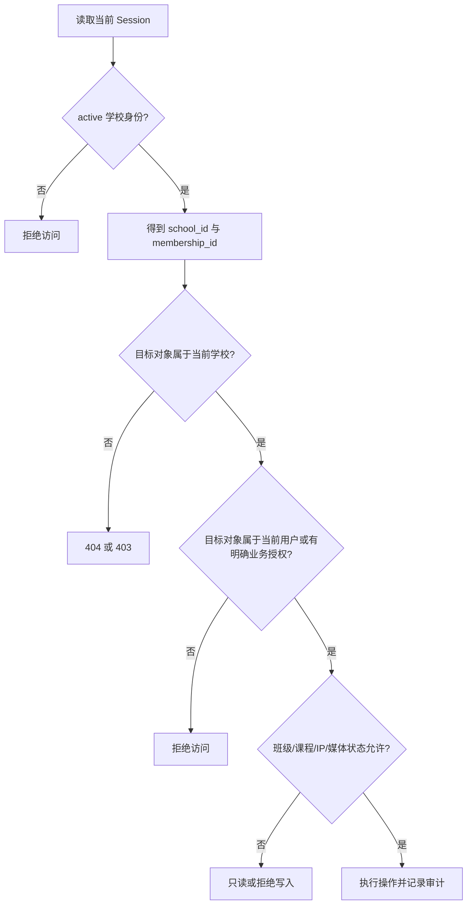

# 学校租户安全与权限 Bug 修复设计

> 设计日期：2026 年 9 月 12 日  
> 依据：`docs/audits/2026-09-12-infinite-practice-audit.zh-CN.md`、当前学校/课程/IP/无限练习源码与已确认的产品规则。

## 1. 文档目的

本文定义学校管理、学校课程、IP 库和无限练习租户隔离相关 Bug 的修复目标与边界，作为后续实施计划和研发验收的唯一产品依据。

本次不是单独修某一个页面按钮，而是统一修复以下四类问题：

1. 学校管理员对本人进行删除、禁用或降权的高风险操作；
2. 学生导入的输入真实性、批次记录和原子性；
3. 班级停用后的课程资料读写边界和底层 SQL 租户条件；
4. IP 授权边界、下载审计和使用记录目标真实性；
5. 无限练习数据的学校作用域、个人所有权和普通素材授权。

## 2. 最终产品结论

### 2.1 学校管理员不能自我移除或自我降权

学校管理员无论学校是否还有其他可用管理员，都不能在成员管理中对本人执行：

- 删除本人 membership；
- 禁用本人 membership；
- 将本人角色改为 student；
- 取消本人的 `school.manage`；
- 任何会导致本人失去学校管理入口的组合修改。

如需管理员主动离校或转交管理权限，后续单独设计“退出学校/转交管理权”流程，不复用成员删除、禁用或编辑接口。

### 2.2 成员导入全量预检、整批提交

学生或老师批量导入采用：

```text
上传文件 → 解析 → 逐行预检 → 展示全部错误
→ 有任意错误：整批不入库
→ 全部通过：一个事务内导入
```

`displayName` 是真实姓名字段，必须填写，不能用 `username` 静默替代。`role` 只能是英文枚举 `student` 或 `teacher`，非法角色必须在预览阶段定位到具体行。

### 2.3 班级停用后历史只读

班级进入 `disabled` 后，当前仍有学校身份且属于该班级历史业务范围的用户可以查看历史课程、资料、教学任务、提交和批改结果，但不能产生任何新的教学写入。

停用班级不是删除历史数据，也不是立即隐藏全部历史内容。用户被移出学校、membership 被禁用或学校被停用后，仍按学校身份规则拒绝访问。

### 2.4 无限练习是“学校作用域、个人所有”

每条无限练习数据同时具备：

```text
school_id：租户边界
user_id：个人所有者
```

读取或写入必须同时满足：

```text
当前 active school_id = 数据 school_id
AND
当前用户 = 数据 user_id
```

用户离开学校 A 并加入学校 B 后，不能访问学校 A 的练习数据，也不能把学校 A 的练习数据带入学校 B。重新加入学校 A 后，可以恢复访问自己在学校 A 创建的数据。

### 2.5 普通练习 asset 必须绑定当前学校

普通 `asset` 只有在以下条件全部满足时才可进入无限练习：

```text
媒体记录存在
AND 媒体未过期
AND owner_user_id = 当前用户
AND school_id = 当前 active school_id
AND 媒体类型与输入槽匹配
```

没有学校归属的历史个人素材不能直接用于无限练习，也不能因为用户加入新学校而自动获得当前学校使用权。后续如需使用，必须通过显式的“复制到当前学校练习”动作生成新的学校作用域引用；该复制动作不属于本次修复的隐式兼容行为。

## 3. 统一授权模型

所有学校业务服务统一使用以下顺序：



### 3.1 服务端推导，不接受客户端租户字段

以下字段都必须由服务端当前 Session 推导，客户端提交的同名字段不能覆盖：

- `school_id`；
- `membership_id`；
- 练习数据的 `owner_user_id`；
- IP 下载记录的 `school_id`；
- IP 使用目标的归属学校。

客户端提交伪造的学校 ID 时，服务端可以忽略该字段，也可以按输入无效返回 400，但不能使用它进行授权判断。

### 3.2 读、写、删除都要校验

不能只在列表接口校验学校，详情、编辑、删除、重试、恢复、下载、导入和任务派发都必须再次校验。

“页面隐藏按钮”不等于权限完成。Route Handler、Service 和 Repository 需要分别承担：

- Route Handler：登录身份和请求参数边界；
- Service：业务权限、状态机和目标归属；
- Repository：最终 SQL 的学校/对象条件、事务和并发约束。

## 4. 学校管理修复设计

### 4.1 禁止管理员自删、自禁用、自降权

#### 目标行为

成员管理接口收到目标 membership 后，先解析目标成员的 `user_id`，如果：

```text
target.user_id = current_operator.user_id
```

且操作会造成以下任一结果：

- 删除 membership；
- `status` 变为 `disabled`；
- `role` 变为 `student`；
- `permissions` 移除 `school.manage`；

则统一拒绝。

建议错误响应：

```text
HTTP 409
不能在成员管理中删除、禁用或取消自己的管理权限，请由另一名学校管理员操作
```

#### 前端行为

成员列表中对本人：

- 删除按钮禁用；
- 禁用按钮禁用；
- 角色降为学生的入口禁用；
- 取消管理入口禁用；
- 显示“当前操作者”标识；
- 悬停或帮助说明显示“需由另一名学校管理员操作”。

禁用按钮和取消管理按钮不能只添加确认弹窗来代替服务端禁止。确认弹窗保留给对其他成员的高风险操作。

#### 管理员不变量

现有“学校至少保留一名可用管理员”规则继续保留，但它不是自我操作限制的替代规则：

```text
即使存在第二名管理员，也不能操作本人。
```

### 4.2 成员导入模板、预览和批次记录

#### 模板和示例

学校成员导入页面必须提供：

- CSV 模板下载；
- 可直接复制的示例；
- 字段说明；
- `student` / `teacher` 角色说明；
- UTF-8 编码提示；
- 密码格式和初始密码安全提示。

模板字段固定为：

```csv
username,displayName,password,role
student001,张三,Password123,student
teacher001,李老师,Password123,teacher
```

#### 预检规则

预览阶段逐行返回结构化错误：

```text
行号
字段名
错误码
管理员可读错误
```

必须覆盖：

- 缺少表头；
- 必填列缺失；
- `username` 为空或格式错误；
- `displayName` 为空；
- `password` 不符合当前密码规则；
- `role` 不是 `student` 或 `teacher`；
- 文件内用户名重复；
- 与系统已有账号冲突；
- 账号已属于学校；
- 文件编码不是 UTF-8；
- 空行、列数不一致和非法字符。

预览结果必须展示：

```text
总行数
可导入行数
错误行数
错误详情
```

#### 原子导入

只有预检完全通过时，才在一个事务中：

1. 创建用户账号；
2. 创建学校 membership；
3. 写入导入批次成功状态；
4. 写入汇总审计。

任意一行落库失败时：

- 回滚整批用户和 membership；
- 批次状态为 `failed`；
- 返回可定位的失败原因；
- 不留下半批账号。

明文密码只允许存在于请求处理内存中，不得写入：

- 导入批次表；
- 导入行表；
- 审计日志；
- 服务端普通日志；
- 错误响应。

#### 导入批次数据

需要有可查询的导入批次记录，至少包括：

- 批次 ID；
- 学校 ID；
- 操作管理员 ID；
- 原文件名；
- 开始时间、结束时间；
- 总行数、成功数、失败数；
- 批次状态：预检失败、导入成功、导入失败；
- 逐行错误详情，但不含密码；
- 审计事件 ID 或可追溯 action。

建议使用独立导入批次及错误明细持久化结构，不把大量逐行错误塞进单条审计日志 JSON。审计日志保存批次摘要和操作人，批次明细保存行号及错误内容。

## 5. 学校课程修复设计

### 5.1 班级停用后的权限矩阵

| 操作 | 班级 active | 班级 disabled |
| --- | --- | --- |
| 查看已分配课程 | 允许 | 允许，只读 |
| 查看课程树 | 允许 | 允许，只读 |
| 查看已有课程资料 | 允许 | 允许，只读 |
| 查看历史教学任务 | 允许 | 允许，只读 |
| 查看本人历史提交 | 允许 | 允许，只读 |
| 查看已完成批改 | 允许 | 允许，只读 |
| 上传课程资料 | 允许 | 拒绝 |
| 修改课程资料 | 允许 | 拒绝 |
| 删除课程资料 | 允许 | 拒绝 |
| 创建教学任务 | 允许 | 拒绝 |
| 修改教学任务 | 允许 | 拒绝 |
| 新增作业提交 | 允许 | 拒绝 |
| 再次提交作业 | 按作业规则 | 拒绝 |
| 修改批改结果 | 按老师职责 | 拒绝 |

停用班级后的只读读取仍必须满足：

```text
当前学校 active
AND 当前用户仍有 active school membership
AND 目标数据属于当前 school_id
AND 用户属于该班级的有效历史业务范围
```

学校管理员的班级启用、停用和归档操作属于治理操作，不受“停用班级禁止教学写入”限制。

### 5.2 资料写操作的双重状态校验

课程资料上传、修改和删除必须同时确认：

```text
学校仍 active
AND 当前用户拥有本校课程资料操作权限
AND 相关班级仍 active
AND 课程分配仍 active
AND 资料属于当前 school_id
```

不能因为课程安排和负责老师关系仍有效，就跳过班级状态检查。

### 5.3 Repository SQL 必须携带学校条件

资料更新和删除不能只使用资料 ID：

```sql
-- 禁止
UPDATE course_materials SET ... WHERE id = $1;
DELETE FROM course_materials WHERE id = $1;
```

必须至少带上学校作用域，且优先通过课程分配和班级关系一起约束：

```sql
UPDATE course_materials material
SET ...
WHERE material.id = $1
  AND material.school_id = $2
  AND EXISTS (
      SELECT 1
      FROM school_course_assignments assignment
      WHERE assignment.id = material.school_course_assignment_id
        AND assignment.school_id = $2
  );

DELETE FROM course_materials material
WHERE material.id = $1
  AND material.school_id = $2
  AND EXISTS (
      SELECT 1
      FROM school_course_assignments assignment
      WHERE assignment.id = material.school_course_assignment_id
        AND assignment.school_id = $2
  );
```

如果当前表没有直接的 `school_id`，Repository 需要通过参数化 JOIN 或 `EXISTS` 由课程分配关系推导学校，不能退回到只按 ID 操作。

学校 A 使用学校 B 的资料 ID 时，必须得到 0 行更新/删除，并由 Service 转换为无权访问或资料不存在，不得修改 B 的数据。

## 6. IP 库修复设计

### 6.1 部分子 IP 授权时的封面选择

IP 包级封面不能直接信任全局 `cover_file_id`。返回给学校用户的封面必须按当前用户可见子 IP 重新解析：

```text
全局封面属于当前可见子 IP
→ 返回全局封面

全局封面不属于当前可见子 IP
→ 返回当前可见子 IP 中确定性排序的第一张封面

当前可见子 IP 没有封面
→ 返回系统默认占位图，不返回未授权文件
```

封面文件、子 IP、IP 本体和学校授权的关系必须在同一授权查询中确认，不能先查授权子 IP、再无条件读取全局封面。

### 6.2 公共 IP 下载记录必须带学校

下载请求的学校归属由服务端当前 Session 推导：

```text
active school membership 存在
→ download_record.school_id = 当前 school_id

没有学校身份的公共下载
→ download_record.school_id = NULL
```

客户端提交的 `schoolId` 忽略。下载记录至少保留：

- `user_id`；
- `school_id`；
- IP ID；
- 子 IP 或下载项 ID；
- 下载类型；
- 时间；
- 成功/失败状态。

学校停用或 membership 失效时，不得继续伪造学校上下文写入新的学校下载记录。

### 6.3 IP 使用记录的 targetId 必须真实存在且有权

`recordIpReferenceUsage()` 在写入使用记录前，按 `targetType` 解析目标：

```text
canvas
→ Canvas 项目存在、owner_user_id = 当前用户、school_id = 当前学校、execution_profile = open-source-practice

drama
→ Drama 项目存在、owner_user_id = 当前用户、school_id = 当前学校、execution_profile = open-source-practice

practice
→ Practice Session 或练习项目存在、owner_user_id = 当前用户、school_id = 当前学校
```

目标不存在、类型不匹配、目标属于其他用户或其他学校时：

- 不创建 IP 使用记录；
- 不增加使用统计；
- 不产生成功审计；
- 返回目标不存在或无权访问。

IP 授权检查和 target 校验必须在同一业务操作的有效边界内完成，不能先写 usage 再异步验证目标。

## 7. 无限练习租户隔离修复设计

### 7.1 数据范围

以下无限练习核心数据必须增加或明确持有不可变 `school_id`：

- `practice_sessions`；
- `canvas_projects` 中 `execution_profile = open-source-practice` 的项目；
- `drama_projects` 中 `execution_profile = open-source-practice` 的项目；
- `practice_script_projects`；
- 剧本版本、实体、阶段和 Agent 操作；
- 练习生成任务和任务上下文；
- 练习生成日志；
- 练习生成媒体注册记录；
- 练习 IP 使用目标和使用记录。

`owner_user_id` 或 `user_id` 继续表示个人所有者，不能用 `school_id` 替代。

### 7.2 创建规则

创建练习项目、Session、剧本、生成任务或练习媒体时：

1. 服务端调用 `requireActiveSchoolContext()`；
2. 检查学校为 active；
3. 检查 membership 为 active；
4. 检查角色为 teacher 或 student；
5. 将 `school_id` 写入所有可查询的练习主记录；
6. 忽略客户端提交的 `school_id`；
7. 创建后不允许修改 `school_id` 或所有者。

练习复制、重试和恢复必须继承原记录的 `school_id`，并检查当前 Session 仍属于同一学校。

### 7.3 读取和写入条件

练习主记录的所有读写都必须带双重条件：

```sql
WHERE school_id = $currentSchoolId
  AND (owner_user_id = $currentUserId OR user_id = $currentUserId)
```

必须覆盖：

- 列表；
- 详情；
- 编辑；
- 删除；
- 重试；
- 幂等 `client_request_id` 查询；
- 任务状态恢复；
- 结果读取；
- 项目 ID 猜测；
- 从 Canvas/Drama 普通入口进入练习项目。

学校管理员不因为 `school.manage` 自动获得学生练习正文、提示词或媒体的读取权。教学提交、作业或商单成果需要通过对应业务授权另行开放。

### 7.4 存量处理

当前环境和测试环境的无限练习存量不作为需要迁移的正式数据。本次上线实施时统一清理 practice 存量，不做历史学校归属推断，不把旧记录自动归到用户当前学校。

清理范围只包含明确的练习数据和练习关联媒体/任务；以下正式数据不能被清理：

- 正式 Canvas/Drama 项目；
- 普通个人素材；
- 作品广场作品；
- 课程和学校数据；
- IP 库正式内容；
- 与其他业务仍有引用关系的媒体。

数据库升级仍然使用幂等 SQL，不通过删库或重建数据卷实现清理。

## 8. 普通 asset 授权修复设计

### 8.1 引用类型

普通练习请求中的引用类型必须明确区分：

```text
asset            当前用户、当前学校作用域的媒体
ip               IP 库内容，走 IP 授权
course-material  课程资料，走课程/班级授权
project-asset    项目协作素材，走项目成员和学校授权
```

本次不允许把他人的课程资料、项目媒体或 IP 内容伪装成普通 `asset`。

### 8.2 创建 Session 前校验

`createPracticeSessionForUser()` 在写入 Session 之前完成：

1. 当前学校和 membership 校验；
2. `asset` registration 存在性校验；
3. `owner_user_id` 校验；
4. `school_id` 校验；
5. 有效期校验；
6. 输入槽和真实媒体类型校验；
7. IP、课程资料、项目协作素材按各自业务授权校验；
8. 练习模块与引用类型的匹配校验。

校验失败时：

- 不创建失败 Session；
- 不创建生成任务；
- 不产生积分消费；
- 不写 IP 使用记录；
- 不发送上游请求。

### 8.3 输入槽媒体类型

| 输入槽 | 允许类型 |
| --- | --- |
| `referenceImage` | image |
| `sceneImage` | image |
| `firstFrameImage` | image |
| `lastFrameImage` | image |
| `characterPropImage1` | image |
| `characterPropImage2` | image |
| `characterPropImage3` | image |
| `image` | image |
| `audio` | audio |

媒体类型必须来自注册记录的真实 `type`，不能根据 URL 后缀、文件名或客户端声明推断。

### 8.4 派发、重试和恢复前再次校验

创建时通过不代表执行时永远有效。以下阶段必须再次校验：

- 生成任务实际创建；
- Session 重试；
- 未完成任务恢复；
- 向上游签发媒体 URL；
- Worker 继续执行。

如果素材被删除、过期、撤销学校作用域或当前用户离开学校，任务必须停止使用该素材并返回明确的授权失效状态。

## 9. 错误和审计规则

### 9.1 错误状态

建议统一使用：

- `401`：未登录；
- `403`：当前账号没有学校/业务权限；
- `404`：目标不存在或不属于当前租户，避免暴露其他学校对象是否存在；
- `409`：状态冲突、自我管理操作、班级已停用、批次原子导入冲突；
- `422`：批量导入预检有逐行业务错误。

错误文案必须说明真正原因，不使用“保存失败”“请求失败”等无诊断价值的泛化文案。

### 9.2 审计事件

至少记录：

```text
admin.school.member.self-operation.blocked
admin.school.member.import.preview
admin.school.member.import.success
admin.school.member.import.failure
admin.school.course-material.write.blocked
admin.ip.download
admin.ip.reference.blocked
practice.tenant.access.denied
practice.asset.reference.denied
```

审计记录保留：操作人、学校、目标类型、目标 ID、结果、错误码和必要元数据，不保存密码、完整媒体内容或不必要的敏感请求体。

## 10. 实施文件边界

### 10.1 主要服务端位置

后续实施主要涉及：

- `web/src/lib/server/school-tenant-service.ts`：自我成员操作拦截；
- `web/src/lib/server/school-member-provisioning-service.ts`：导入预检、原子导入和批次；
- `web/src/lib/server/school-course-service.ts`：班级状态与课程资料写入权限；
- `web/src/lib/server/school-domain-repository.ts`：课程资料权限接口；
- `web/src/lib/server/database/school-domain-repository.ts`：课程资料 SQL 学校条件；
- `web/src/lib/server/school-ip-library-service.ts`：学校 IP 可见范围；
- `web/src/lib/server/ip-library-access-service.ts`：当前学校上下文；
- `web/src/lib/server/ip-library-download-service.ts`：下载记录 school_id；
- `web/src/lib/server/ip-library-service.ts`：targetId 目标真实性校验；
- `web/src/lib/server/practice-access-service.ts`：学校作用域推导；
- `web/src/lib/server/practice-session-service.ts`：Session 创建前 asset 校验；
- `web/src/lib/server/practice-project-service.ts`：练习项目 school_id；
- `web/src/lib/server/script-practice-service.ts`：剧本练习 school_id；
- `web/src/lib/server/local-media-registry.ts`：媒体学校作用域和查询；
- `web/src/app/api/practice/sessions/route.ts`：请求边界和引用传递；
- `web/src/app/api/practice/sessions/[id]/route.ts`：重试和详情授权；
- 对应课程、IP、学校成员和练习 API Route Handler；
- `web/src/lib/server/database/schema.ts` 与 `schema-school-domain.ts`：有序幂等 Schema 升级；
- `docs/content/docs/backend/backend-database.mdx`：新增字段、索引、批次表和升级规则说明。

### 10.2 前端范围

本设计不是前端重做。只允许做必要的后台交互调整：

- 对本人危险操作显示禁用状态和原因；
- 成员导入增加模板、预览错误、批次结果；
- 班级停用后显示只读状态；
- 无无限练习前端重构要求；
- 练习页面不通过客户端逻辑承担租户授权。

## 11. 测试与验收设计

### 11.1 学校管理员安全测试

建立学校 A，至少两个可用管理员：

- 管理员 A 删除自己：`409`，数据不变；
- 管理员 A 禁用自己：`409`，数据不变；
- 管理员 A 取消自己 `school.manage`：`409`，数据不变；
- 管理员 A 将自己改为 student：`409`，数据不变；
- 管理员 A 操作管理员 B：按正常权限规则执行；
- 非学校管理员调用成员管理：拒绝。

### 11.2 批量导入测试

覆盖：

- 模板和示例内容可下载；
- 空 `displayName` 在预览阶段报错；
- `role=老师` 在预览阶段报告具体行错误；
- 文件内重复用户名定位正确；
- 一行错误时所有账号都不创建；
- 全部通过时整批创建成功；
- 数据库异常时事务整体回滚；
- 批次记录有学校、操作人、统计和逐行错误；
- 密码不出现在数据库、审计和响应中。

### 11.3 课程双学校测试

建立学校 A、学校 B，并准备可区分的课程资料：

- A 的老师更新 B 的资料 ID：0 行更新，B 数据不变；
- A 的老师删除 B 的资料 ID：0 行删除，B 数据不变；
- 停用 A 的班级后上传/修改/删除：拒绝；
- 停用 A 的班级后读取课程树和历史资料：允许只读；
- 停用 A 的班级后新增提交和再次提交：拒绝；
- 学校 B 的成员不能读取 A 的课程资料。

### 11.4 IP 库测试

- 学校只授权子 IP B 时，包级封面不能返回子 IP A 的文件；
- 授权子 IP B 有封面时返回 B 封面；
- 可见子 IP 没有封面时返回默认占位图；
- 学校 A 用户下载公共 IP，记录 `school_id=A`；
- 无学校用户下载公共 IP，记录 `school_id=NULL`；
- 伪造其他用户 Canvas/Drama/Practice 的 `targetId` 不产生 usage；
- targetType 与目标类型不匹配时不产生 usage；
- IP 授权撤销后新的 usage 被拒绝。

### 11.5 无限练习租户测试

建立学校 A、学校 B 和同一用户的转校夹具：

1. 用户在 A 创建练习项目、Session、剧本和素材；
2. 用户离开 A 并加入 B；
3. 访问 A 的项目 ID、Session ID、剧本 ID 和任务结果：拒绝；
4. 在 B 创建新数据：成功，`school_id=B`；
5. B 下不能引用 A 的普通 asset；
6. 无 `school_id` 的个人历史素材不能作为普通 asset 进入练习；
7. 重新加入 A 后，可以访问自己在 A 的数据；
8. 其他用户即使属于 A，也不能读取该用户的私有练习数据；
9. 客户端伪造 `school_id` 不影响服务端实际写入；
10. 清理当前旧 practice 存量不会删除正式项目和普通个人素材。

### 11.6 必须执行的质量门禁

后续实施完成前必须执行：

```powershell
pnpm --dir web vitest run --no-file-parallelism <学校成员、课程、IP、练习相关测试>
pnpm --dir web run typecheck
pnpm --dir web run lint -- --quiet
pnpm --dir web run format:check
pnpm --dir web run e2e -- <双学校安全与练习租户回归>
pwsh -NoProfile -File .\过程文件\更新开发地图.ps1
pwsh -NoProfile -File .\过程文件\验证开发文档.ps1
```

实际执行时必须替换尖括号为仓库中真实存在的测试路径，不能把占位命令当作通过证据。

## 12. 本期不做

1. 不增加学校之间的任意数据共享；
2. 不让学校管理员默认查看全部学生练习正文；
3. 不把个人历史素材自动迁移到新学校；
4. 不做跨学校数据恢复工具；
5. 不改变正式 Canvas、Drama、作品、个人素材和课程的原有个人/学校业务边界；
6. 不把所有普通个人媒体一次性改造成学校媒体；
7. 不用前端隐藏代替后端授权；
8. 不通过删库或重建数据库解决租户问题；
9. 不在本期实现“复制个人素材到当前学校”的完整产品入口；
10. 不引入新的学校角色体系。

## 13. 完成判定

只有以下条件全部满足，才能认为本设计已经落地：

- 学校管理员不能自删、自禁用、自降权；
- 成员导入有模板、示例、逐行预检、批次记录和整批原子提交；
- 空姓名不会再静默替换成用户名；
- 非法角色在提交前即可定位；
- 停用班级进入历史只读，所有教学写操作被阻止；
- 课程资料 Repository 的最终 SQL 携带学校边界；
- 未授权子 IP 的包级封面不会被返回；
- 公共 IP 下载记录能够记录当前学校；
- IP 使用记录的 targetId 无法伪造；
- 无限练习新数据带有不可变 `school_id` 和个人所有者；
- 用户转校后不能跨学校读取或使用练习数据；
- 普通 asset 在 Session 创建前完成用户、学校、有效期和类型校验；
- 非法素材不会产生失败 Session、任务、积分或 IP 使用记录；
- 普通正式业务不受影响；
- 双学校接口测试、集成测试、类型检查、Lint、格式检查和开发文档验证均有真实证据。
