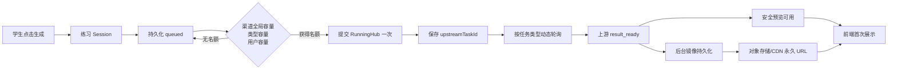
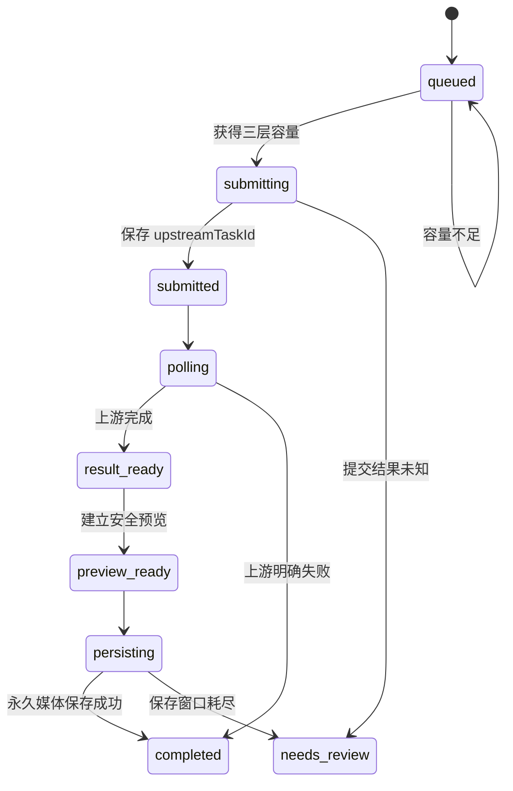

# 无限练习生成链路性能优化设计

**日期：** 2026-09-13
**状态：** 待实施
**依据：** `docs/superpowers/reports/2026-09-13-infinite-practice-runninghub-latency-report.md`

## 1. 目标

在不修改 7 条 RunningHub 业务契约、不重复创建上游任务、不降低结果持久性的前提下，使无限练习能够稳定支撑两个各 50 人的课堂突发请求，并把平台自身造成的等待从上游生成耗时中分离、量化和优化。

## 2. 范围与约束

- 只改无限练习 / `open-source-practice`。
- 不改变商业生产入口并发与计费语义。
- 不修改 7 个工作流的入参、节点映射和输出契约。
- 已保存 `upstreamTaskId` 后只查询原任务，不允许重建或重复计费。
- 并发限制来自管理员配置，不新增拍脑袋固定业务上限。
- 430px 移动端不在本次范围。
- 没有可信 RunningHub 官方回调契约前，不实现猜测的 webhook。

## 3. 当前问题

1. `generationConcurrency=100` 是每用户、每类型限制，无法保护 RunningHub 渠道总在途任务。
2. 任务超过 120 秒后 25 秒查询一次，长视频结果发现偏慢。
3. 任务时间只散落在 `created_at/submitted_at/last_poll_at/updated_at`，缺少用户体感的完整阶段指标。
4. 结果必须完成平台镜像保存后才能显示，集中完成时持久化槽位会形成尾部排队。
5. 如果生产对象存储未启用，媒体由应用服务器本地磁盘服务，100 人播放会形成单机出口瓶颈。
6. 当前 FIFO 只在到期任务维度成立，缺少学校/班级公平调度，某个用户连续提交可能占用渠道额度。

## 4. 目标架构



## 5. 设计方案

### 5.1 渠道级全局并发池

管理员配置增加渠道级容量：

```ts
type PracticeChannelConcurrency = {
    total: number;
    image: number;
    video: number;
    audio: number;
    text: number;
};
```

准入必须同时满足：

```text
用户类型并发未满
AND 渠道 total 未满
AND 渠道 capability 未满
```

PostgreSQL 使用 advisory lock + reservation 原子占位，活动阶段继续使用：

```text
submitting/submitted/polling/result_ready/persisting
```

`queued` 不占额度。任务结束、取消、失败或 lease 过期后释放。文件 Provider 仅保留开发回退语义。

### 5.2 公平排队

基础顺序仍为 `nextPollAt, createdAt, id`，但准入采用按 `schoolId + userId` 的轮转窗口：

- 同一用户同类型同时只提升管理员允许的数量。
- 同学校多个用户轮转，避免单个学生连续点击占满全部渠道槽。
- 不强制任务按提交顺序完成；只保证任务身份、归属和结果不串线。

### 5.3 类型化轮询策略

轮询策略由管理员配置或现有供应商公开约束驱动：

- 图片/音频短任务维持当前 5/10/25 秒节奏。
- 视频在 120 秒后默认仍可按管理员配置调低到 10 秒。
- 配置需要最小值保护，避免误设成高频攻击上游。
- 查询错误继续指数退避，不用固定次数把处理中任务标记失败。

如后续获得 RunningHub 已验证 webhook 文档，再新增签名回调；轮询继续作为丢通知兜底。

### 5.4 阶段耗时可观测性

在 `generation_tasks` 增加幂等迁移列：

```text
queued_at
admitted_at
upstream_ready_at
persistence_started_at
persisted_at
```

现有 `created_at/submitted_at/last_poll_at/updated_at` 保留。前端首次显示通过一次轻量埋点写入 `client_displayed_at`，只记录任务 ID、时间和媒体类型，不记录提示词或隐私内容。

后台统计输出：

```text
queueMs
submitMs
upstreamMs
detectLagMs
persistMs
clientLagMs
totalVisibleMs
```

按 workflowCode、学校、任务类型、时间窗口显示 P50/P95/P99、错误率和积压数。

### 5.5 预览与永久保存解耦

状态扩展为：

```text
result_ready -> preview_ready -> persisting -> completed
```

- 上游完成后先生成受鉴权的站内代理预览 URL。
- 后台继续镜像保存，不把 RunningHub URL直接永久暴露给客户端。
- 持久化成功后替换为永久平台 URL。
- 预览读取失败时回到等待状态，不宣称成功、不重复创建任务。
- 图片首屏使用限宽 WebP；点击预览/下载才读取原图。
- 视频使用 Range 和封面，播放器可首帧可见后播放，不等待浏览器完整下载。

### 5.6 对象存储和 CDN

生产验收必须确认：

- `persistExternalMediaIfEnabled` 已实际写入对象存储。
- 返回 URL 经站内鉴权或短期签名跳转到 CDN。
- 支持 `HEAD`、Range、正确 MIME 和 Content-Length。
- 100 并发播放不经过 Next.js 进程完整转发媒体字节。

未启用对象存储时，后台应明确告警“当前仅适合小规模测试”。

### 5.7 工作流级优化建议

不在平台代码中直接改工作流，只输出给工作流维护人员验证：

- `storyboard_shot_video`：52 节点；检查模型重复加载、音频分支是否可关闭、训练预览是否可用更快实例。
- `character_multi_view`：29 节点；确认四视角可否并行、主视图是否被重复生成。
- `scene_main_view`：历史响应有两张结果；确认是否确需两张，避免计算了第二张但平台只展示一张。
- `prop_main_view`：当前 19 秒，不优先改动。

## 6. 状态与一致性



任何恢复路径先检查本地 `upstreamTaskId`。存在时只能查询，禁止重新创建。

## 7. 验收目标

以下是平台目标，不包含 RunningHub 自身生成时间：

| 指标 | 目标 |
|---|---:|
| 提交请求 API P95 | ≤ 2 秒 |
| 有容量时 queue/admit P95 | ≤ 2 秒 |
| 图片/音频 detect lag P95 | ≤ 12 秒 |
| 视频 detect lag P95 | ≤ 15 秒（配置 10 秒轮询后） |
| 图片 preview ready P95 | 上游完成后 ≤ 5 秒 |
| 视频 preview ready P95 | 上游完成后 ≤ 10 秒 |
| 50 人/100 人任务串线、重复上游创建 | 0 |
| 50 人图片任务平台错误率 | < 1% |
| 100 人图片任务平台错误率 | < 1% |
| 100 人视频结果播放由应用进程直出 | 0 |

## 8. 发布策略

- 所有新行为以无限练习范围和管理员配置控制。
- 先上线指标，再上线全局准入，再调整轮询，再做预览/CDN。
- 每阶段可独立回滚；回滚不能删除时间列或丢失 queued 任务。
- 真实 50/100 用户压测必须安排测试窗口和费用预算，不在日常课堂直接试错。
